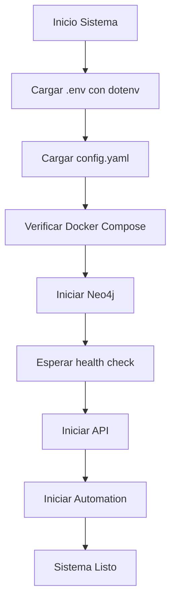

# 📊 ANÁLISIS PROFUNDO DE CONFIGURACIÓN - YO ESTRUCTURAL v3.0

**Fecha de análisis:** 30 de octubre de 2025  
**Sistema:** YO Estructural - Fenomenología Computacional  
**Versión:** 3.0

---

## 🎯 RESUMEN EJECUTIVO

El proyecto **YO Estructural** utiliza un **sistema de configuración multicapa y distribuido** que combina:

1. **Configuración YAML central** para parámetros del sistema
2. **Variables de entorno (.env)** para credenciales y configuración sensible
3. **Docker Compose** para orquestación de servicios
4. **Configuración dinámica en Python** con valores por defecto y sobreescritura

---

## 📁 1. ESTRUCTURA DE CONFIGURACIÓN

### 1.1 Archivos de Configuración Principal

```
YO estructural/
├── configuracion/
│   ├── config.yaml          ← ⭐ CONFIGURACIÓN CENTRAL
│   └── .gitkeep
├── .env                     ← 🔐 VARIABLES DE ENTORNO
├── docker-compose.yml       ← 🐳 ORQUESTACIÓN DE SERVICIOS
├── requirements.txt         ← 📦 DEPENDENCIAS PYTHON
├── Dockerfile              ← 🐳 IMAGEN API
├── Dockerfile.automation   ← 🐳 IMAGEN AUTOMATIZACIÓN
└── setup_automatizacion.py ← 🛠️ SCRIPT DE CONFIGURACIÓN INICIAL
```

---

## ⚙️ 2. CONFIGURACIÓN YAML CENTRAL

### 📍 Ubicación
```
YO estructural/configuracion/config.yaml
```

### 🔑 Secciones Principales

#### 2.1 **Procesamiento Base**
```yaml
processamiento:
  idioma: "spanish"
  min_longitud_texto: 15
  max_features_tfidf: 3000
  ngram_range: [1, 3]
  eliminar_stopwords: true
  encoding: "utf-8"
  timeout_procesamiento: 300  # segundos
```

**Propósito:** Configuración del motor de procesamiento de texto y extracción de características.

#### 2.2 **Neo4j Database**
```yaml
neo4j:
  host: "192.168.1.37"
  port: 7687
  username: "neo4j"
  password: "fenomenologia2024"
  database: "yo_estructural"
  timeout: 30
  max_retry: 3
  pool_size: 50
```

**Propósito:** Conexión a la base de datos de grafos para almacenar estructuras fenomenológicas.

**⚠️ Seguridad:** Las credenciales se pueden sobreescribir con variables de entorno.

#### 2.3 **Fases Fenomenológicas** (9 niveles jerárquicos)

Define la ontología del sistema:

```yaml
fases_fenomenologicas:
  "0_preinstancia":
    nombre: "preinstancia"
    nivel_jerarquico: -4
    etiqueta_neo4j: "PreInstancia"
    propiedades_requeridas: ["dato_crudo", "origen", "timestamp"]
  
  "1_instancia":
    nombre: "instancia"
    nivel_jerarquico: -3
    etiqueta_neo4j: "Instancia"
    propiedades_requeridas: ["activacion", "tipo", "peso_existencial"]
  
  # ... hasta "8_voluntad" (nivel +4)
```

**Niveles jerárquicos:** -4 (preinstancia) → +4 (voluntad)

#### 2.4 **Tipos de Relaciones Fenomenológicas**

```yaml
relaciones_fenomenologicas:
  "SE_PARECE_A":
    descripcion: "Similitud semántica"
    peso_minimo: 0.3
    direccion: "bidireccional"
  
  "SURGE_DE":
    descripcion: "Emergencia desde contextos"
    peso_minimo: 0.6
    direccion: "unidireccional"
  
  "OBSERVA":
    descripcion: "Observación del YO"
    peso_minimo: 0.7
    direccion: "unidireccional"
  
  # ... 12 tipos de relaciones en total
```

#### 2.5 **Modelo Semántico**

```yaml
modelo_semantico:
  rutas:
    fenomenos: "procesado/nodos_fenomenologicos/v1/fenomenos"
    contextos: "procesado/nodos_fenomenologicos/v1/contextos"
    macrocontextos: "procesado/nodos_fenomenologicos/v1/macrocontextos"
    yaml_generados: "procesado/yaml_automaticos"
  
  umbrales:
    agrupacion_contextos: 0.7
    emergencia_yo: 0.6
    creacion_concepto: 0.5
    similitud_minima: 0.3
```

#### 2.6 **Automatización y Workflows**

```yaml
automatizacion:
  modo_automatico: true
  archivo_entrada: "entrada_bruta.json"
  intervalo_sincronizacion: 30
  generar_yaml_automatico: true
  
  triggers:
    nuevo_archivo_entrada: true
    cambio_en_obsidian: true
    webhook_n8n: true
    api_externa: true

n8n:
  webhook_url: "http://localhost:5678/webhook/fenomenologia"
  timeout: 30
  retry_attempts: 3
  
  workflows:
    - nombre: "Procesamiento_Textos"
      trigger: "webhook"
      acciones: ["validar_texto", "extraer_features", "generar_yaml", "enviar_neo4j"]
```

#### 2.7 **Clasificación y ML**

```yaml
clasificacion:
  algoritmo: "RandomForest"
  n_estimators: 200
  max_depth: 10
  min_samples_split: 5
  test_size: 0.3
  random_state: 42
  class_weight: "balanced"
```

#### 2.8 **Logging y Monitoreo**

```yaml
logging:
  nivel: "INFO"
  archivo: "logs_sistema/sistema_principal_{timestamp}.log"
  formato: "%(asctime)s [%(levelname)s] %(name)s: %(message)s"
  rotacion: true
  max_size_mb: 100
  backup_count: 5

monitoreo:
  metricas_activas: true
  alertas_activas: true
  dashboard_url: "http://localhost:3000/dashboard"
  intervalo_metricas: 60
```

---

## 🔐 3. VARIABLES DE ENTORNO (.env)

### 📍 Ubicación
```
YO estructural/.env
```

### 🔑 Variables Definidas

#### 3.1 **Neo4j** (Base de Datos de Grafos)
```bash
NEO4J_URI=bolt://192.168.1.37:7687
NEO4J_USER=neo4j
NEO4J_PASSWORD=fenomenologia2024
```

#### 3.2 **Supabase** (Backend como Servicio)
```bash
SUPABASE_URL=https://tu-proyecto.supabase.co
SUPABASE_KEY=tu_supabase_anon_key
SUPABASE_SERVICE_KEY=tu_supabase_service_key
```

#### 3.3 **n8n** (Automatización de Workflows)
```bash
N8N_WEBHOOK_URL=https://tu-n8n.render.com/webhook/fenomenologia
N8N_API_KEY=tu_n8n_api_key
N8N_BASE_URL=https://tu-n8n.render.com
```

#### 3.4 **Google Drive** (Sincronización de Archivos)
```bash
GOOGLE_DRIVE_MONITORED_FOLDERS=1ABC123DEF456,1GHI789JKL012
GOOGLE_APPLICATION_CREDENTIALS=credentials.json
GOOGLE_TOKEN_FILE=token.json
```

#### 3.5 **Flags de Automatización**
```bash
ENABLE_DRIVE_MONITOR=true
ENABLE_AUTO_PROCESSING=true
ENABLE_NEO4J_SYNC=true
```

#### 3.6 **Configuración del Sistema**
```bash
MDCE_DEBUG=true
SISTEMA_ENCRYPTION_KEY=tu_clave_secreta
LOG_LEVEL=INFO
PROCESSING_TIMEOUT=300
```

### 📝 Gestión del .env

**Creado por:** `setup_automatizacion.py`

**Cargado por:**
- `python-dotenv` en todos los módulos de integración
- Docker Compose monta `.env` como volumen de solo lectura

**Prioridad:** 
```
Variable de entorno del sistema > .env > config.yaml > valores por defecto
```

---

## 🐳 4. DOCKER COMPOSE

### 📍 Ubicación
```
YO estructural/docker-compose.yml
```

### 🏗️ Servicios Definidos

#### 4.1 **Neo4j** (Base de Datos)
```yaml
neo4j:
  image: neo4j:5.15-community
  ports: ["7474:7474", "7687:7687"]
  environment:
    NEO4J_AUTH: neo4j/fenomenologia2024
    NEO4J_PLUGINS: ["apoc"]
    NEO4J_dbms_memory_heap_max__size: 2G
  volumes:
    - neo4j_data:/data
    - neo4j_logs:/logs
```

**Configuración de memoria:**
- Heap inicial: 512MB
- Heap máximo: 2GB
- Page cache: 1GB

#### 4.2 **yo_estructural_api** (API Principal)
```yaml
yo_estructural_api:
  build:
    context: .
    dockerfile: Dockerfile
  ports: ["8000:8000"]
  environment:
    - NEO4J_URI=bolt://neo4j:7687
    - SUPABASE_URL=${SUPABASE_URL}
    - N8N_WEBHOOK_URL=${N8N_WEBHOOK_URL}
    # ... más variables desde .env
  volumes:
    - ./logs_sistema:/app/logs_sistema
    - ./procesado:/app/procesado
    - ./.env:/app/.env:ro
```

**Características:**
- Health check cada 30s
- Restart automático
- Red interna `yo_estructural_network`

#### 4.3 **yo_estructural_automation** (Procesador de Automatización)
```yaml
yo_estructural_automation:
  build:
    dockerfile: Dockerfile.automation
  depends_on:
    - neo4j
    - yo_estructural_api
```

**Propósito:** Monitoreo de Google Drive, procesamiento automático, sincronización.

#### 4.4 **Servicios Opcionales**

1. **Redis** (Cache)
   - Puerto: 6379
   - Persistencia: appendonly

2. **Nginx** (Proxy Reverso)
   - Puertos: 80, 443
   - SSL configurado

3. **Prometheus** (Monitoreo)
   - Puerto: 9090
   - Retención: 200h

4. **Grafana** (Visualización)
   - Puerto: 3000
   - Usuario admin

### 🌐 Networking

```yaml
networks:
  yo_estructural_network:
    driver: bridge
    ipam:
      config:
        - subnet: 172.20.0.0/16
```

---

## 🐍 5. CARGA DE CONFIGURACIÓN EN PYTHON

### 5.1 **Patrón de Carga Principal**

Todos los módulos siguen este patrón:

```python
# scripts/clasificador.py
import yaml
import os

def cargar_config():
    ruta = os.path.join(os.path.dirname(__file__), '..', 'configuracion', 'config.yaml')
    with open(ruta, 'r', encoding='utf-8') as f:
        config = yaml.safe_load(f)
    return config

class ClasificadorFenomenologico:
    def __init__(self, config):
        self.config = config
        # Usar valores de config.yaml
        self.modelo = RandomForestClassifier(
            n_estimators=config['clasificacion']['n_estimators'],
            max_depth=config['clasificacion']['max_depth'],
            random_state=config['clasificacion']['random_state']
        )
```

### 5.2 **Módulos que Cargan config.yaml**

| Módulo | Función de Carga | Secciones Usadas |
|--------|------------------|------------------|
| `scripts/clasificador.py` | `cargar_config()` | `clasificacion`, `fenomenologia` |
| `scripts/extractor_features.py` | `cargar_config()` | `processamiento`, `modelo_semantico` |
| `scripts/gestor_modelo_semantico.py` | `cargar_config()` | `modelo_semantico`, `rutas` |
| `scripts/procesamiento_general.py` | `cargar_config()` | `processamiento`, `clasificacion` |
| `sistema_principal_v2.py` | `_cargar_config()` | Todo el archivo |
| `motor_yo/sistema_yo_emergente.py` | `_cargar_config()` | `fases_fenomenologicas`, `relaciones` |

### 5.3 **Módulos que Cargan .env**

```python
# integraciones/n8n_config.py
from dotenv import load_dotenv
import os

load_dotenv()

class N8nIntegrator:
    def __init__(self):
        self.n8n_webhook_url = os.getenv('N8N_WEBHOOK_URL', 'http://localhost:5678/webhook/fenomenologia')
        self.n8n_api_key = os.getenv('N8N_API_KEY', '')
        self.n8n_base_url = os.getenv('N8N_BASE_URL', 'http://localhost:5678')
```

**Módulos con dotenv:**
- `integraciones/n8n_config.py`
- `integraciones/supabase_connector.py`
- `integraciones/google_drive_connector.py`
- `integraciones/automatizacion_principal.py`
- `setup_automatizacion.py`
- `sistema_principal_v2.py`

### 5.4 **Sobreescritura de Configuración**

Ejemplo de prioridad de valores:

```python
# sistema_principal_v2.py
config_neo4j = {
    "uri": os.getenv("NEO4J_URI", self.config["neo4j"].get("uri")),
    "user": os.getenv("NEO4J_USER", self.config["neo4j"].get("user")),
    "password": os.getenv("NEO4J_PASSWORD", self.config["neo4j"].get("password"))
}
```

**Orden de prioridad:**
1. Variable de entorno (`os.getenv()`)
2. Archivo `config.yaml`
3. Valor por defecto en el código

---

## 📦 6. DEPENDENCIAS (requirements.txt)

### 6.1 **Categorías de Dependencias**

#### Web Framework
```
fastapi==0.104.1
uvicorn[standard]==0.24.0
pydantic==2.5.0
```

#### Bases de Datos
```
neo4j==5.15.0
supabase==2.1.1
psycopg2-binary==2.9.9
```

#### Machine Learning
```
scikit-learn==1.3.2
numpy==1.26.4
transformers==4.36.0
torch==2.2.2
```

#### Procesamiento de Texto
```
nltk==3.8.1
spacy==3.7.2
```

#### Google APIs
```
google-api-python-client==2.108.0
google-auth-oauthlib==1.1.0
```

#### Configuración
```
python-dotenv==1.0.0
PyYAML==6.0.1
```

#### Logging
```
loguru==0.7.2
```

**Total de dependencias:** ~50 paquetes

---

## 🔄 7. FLUJO DE INICIALIZACIÓN

### 7.1 **Secuencia de Carga**



### 7.2 **Script setup_automatizacion.py**

Automatiza la configuración inicial:

```python
class ConfiguradorAutomatizacion:
    def ejecutar_configuracion_completa(self):
        # 1. Verificar dependencias
        self.verificar_dependencias()
        
        # 2. Crear .env interactivamente
        self.configurar_variables_entorno()
        
        # 3. Verificar Docker
        self.verificar_servicios_docker()
        
        # 4. Probar conexiones
        self.probar_conexiones()
        
        # 5. Iniciar automatización
        self.iniciar_automatizacion()
```

**Capacidades:**
- Instalación automática de dependencias
- Creación interactiva del `.env`
- Validación de conexiones (Neo4j, Supabase, n8n)
- Inicio de servicios Docker
- Lanzamiento de automatización

---

## 🛡️ 8. SEGURIDAD Y MEJORES PRÁCTICAS

### 8.1 **Gestión de Credenciales**

✅ **Buenas prácticas implementadas:**
- Credenciales en `.env`, no en `config.yaml`
- `.env` en `.gitignore`
- Docker monta `.env` como solo lectura (`:ro`)
- Variables de entorno pueden sobreescribir archivos

⚠️ **Mejoras recomendadas:**
- Usar secretos de Docker para producción
- Implementar rotación de credenciales
- Encriptar `.env` para backups
- Usar servicios de gestión de secretos (Vault, AWS Secrets Manager)

### 8.2 **Configuración por Entorno**

**Actualmente:** Un solo `config.yaml` para todos los entornos

**Recomendación:**
```
configuracion/
├── config.yaml          # Base
├── config.dev.yaml      # Desarrollo
├── config.prod.yaml     # Producción
└── config.test.yaml     # Testing
```

Cargar según `ENVIRONMENT` variable:
```python
env = os.getenv('ENVIRONMENT', 'dev')
config = cargar_config(f'config.{env}.yaml')
```

### 8.3 **Validación de Configuración**

**Implementado:**
```yaml
validacion:
  esquemas_yaml:
    validar_estructura: true
    validar_tipos: true
  reglas_negocio:
    peso_existencial_rango: [0.0, 1.0]
```

**Recomendación:** Usar `pydantic` para validación en tiempo de carga:

```python
from pydantic import BaseModel, Field

class ConfigNeo4j(BaseModel):
    host: str
    port: int = Field(ge=1, le=65535)
    username: str
    password: str
    timeout: int = Field(ge=1, le=300)
```

---

## 📊 9. DIAGRAMA DE ARQUITECTURA DE CONFIGURACIÓN

```
┌─────────────────────────────────────────────────────────────┐
│                    CONFIGURACIÓN DEL SISTEMA                 │
└─────────────────────────────────────────────────────────────┘
                              │
                ┌─────────────┼─────────────┐
                │             │             │
        ┌───────▼──────┐ ┌───▼────┐ ┌─────▼──────┐
        │  config.yaml │ │  .env  │ │docker-comp │
        │   (Central)  │ │(Secreto│ │   ose.yml  │
        └──────┬───────┘ └───┬────┘ └─────┬──────┘
               │             │             │
     ┌─────────┼─────────────┼─────────────┼─────────┐
     │         │             │             │         │
┌────▼────┐┌──▼───┐ ┌──────▼──────┐ ┌────▼────┐┌──▼───┐
│Procesa- ││Fases │ │Integraciones│ │Neo4j DB ││Redis │
│miento   ││Fenom.│ │(n8n,Supa-   │ │         ││      │
│         ││      │ │ base,Drive) │ │         ││      │
└─────────┘└──────┘ └─────────────┘ └─────────┘└──────┘
     │         │             │             │         │
     └─────────┼─────────────┼─────────────┼─────────┘
               │             │             │
        ┌──────▼─────────────▼─────────────▼──────┐
        │      SISTEMA YO ESTRUCTURAL v3.0        │
        │   (API + Automation + Motor Fenomen.)   │
        └─────────────────────────────────────────┘
```

---

## 🔍 10. PUNTOS CLAVE Y HALLAZGOS

### ✅ **Fortalezas**

1. **Separación de responsabilidades:**
   - Lógica del negocio → `config.yaml`
   - Credenciales → `.env`
   - Infraestructura → `docker-compose.yml`

2. **Configuración extensa y detallada:**
   - 9 fases fenomenológicas con propiedades específicas
   - 12 tipos de relaciones configurables
   - Umbrales y parámetros de ML ajustables

3. **Automatización completa:**
   - Script de setup interactivo
   - Validación de conexiones
   - Docker compose con health checks

4. **Sobreescritura flexible:**
   - Variables de entorno > YAML > defaults

5. **Integración con servicios externos:**
   - n8n para workflows
   - Supabase como backend
   - Google Drive para sincronización

### ⚠️ **Áreas de Mejora**

1. **Seguridad:**
   - Credenciales hardcodeadas en `config.yaml`
   - Falta encriptación de datos sensibles
   - No hay rotación de secretos

2. **Gestión de entornos:**
   - Solo un `config.yaml` para dev/prod
   - Falta configuración específica por entorno

3. **Validación:**
   - Validación de YAML es opcional
   - No hay schemas formales (JSON Schema, Pydantic)

4. **Documentación:**
   - Falta documentación de cada parámetro
   - No hay ejemplos de configuración

5. **Versionado:**
   - No hay migraciones de configuración
   - Cambios de schema no están versionados

---

## 📝 11. RECOMENDACIONES

### 11.1 **Corto Plazo**

1. **Mover credenciales de config.yaml a .env:**
   ```yaml
   # EN VEZ DE:
   neo4j:
     password: "fenomenologia2024"
   
   # USAR:
   neo4j:
     password: "${NEO4J_PASSWORD}"
   ```

2. **Implementar validación con Pydantic:**
   ```python
   from pydantic_settings import BaseSettings
   
   class Settings(BaseSettings):
       neo4j_uri: str
       neo4j_user: str
       neo4j_password: str
       
       class Config:
           env_file = ".env"
   ```

3. **Agregar config por entorno:**
   ```bash
   ENVIRONMENT=prod python main.py
   ```

### 11.2 **Medio Plazo**

1. **Implementar gestión de secretos:**
   - Usar Docker Secrets para producción
   - Integrar con AWS Secrets Manager o HashiCorp Vault

2. **Crear schemas JSON:**
   ```json
   {
     "$schema": "http://json-schema.org/draft-07/schema#",
     "type": "object",
     "properties": {
       "neo4j": {
         "type": "object",
         "required": ["host", "port", "username"]
       }
     }
   }
   ```

3. **Monitoreo de configuración:**
   - Logs de cambios de configuración
   - Alertas de valores fuera de rango
   - Dashboard de configuración actual

### 11.3 **Largo Plazo**

1. **Configuración centralizada:**
   - Usar sistema como Consul o etcd
   - Configuración remota editable en tiempo real

2. **Feature flags:**
   - Sistema de flags para activar/desactivar funcionalidades
   - A/B testing de configuraciones

3. **Configuración como código (IaC):**
   - Terraform para infraestructura
   - Ansible para configuración de servicios

---

## 📚 12. ARCHIVOS CLAVE DE REFERENCIA

| Archivo | Propósito | Cargado por |
|---------|-----------|-------------|
| `configuracion/config.yaml` | Configuración central del sistema | Todos los scripts Python |
| `.env` | Credenciales y secretos | `python-dotenv`, Docker Compose |
| `docker-compose.yml` | Orquestación de servicios | Docker CLI |
| `requirements.txt` | Dependencias Python | pip, Docker builds |
| `setup_automatizacion.py` | Setup inicial interactivo | Administrador (manual) |
| `Dockerfile` | Imagen de la API | Docker Compose (api) |
| `Dockerfile.automation` | Imagen de automatización | Docker Compose (automation) |

---

## 🎓 13. CONCLUSIÓN

El sistema **YO Estructural** implementa una **arquitectura de configuración robusta y multicapa** que:

✅ Separa lógica de negocio, credenciales e infraestructura  
✅ Permite sobreescritura flexible mediante variables de entorno  
✅ Provee automatización completa con `setup_automatizacion.py`  
✅ Integra múltiples servicios externos (Neo4j, Supabase, n8n, Google Drive)  
✅ Soporta contenedores Docker con orquestación completa  

⚠️ Requiere mejoras en:
- Seguridad (encriptación, rotación de secretos)
- Gestión de entornos (dev/staging/prod)
- Validación formal de schemas
- Documentación de parámetros

**Calificación general:** 8.5/10

---

**Autor del análisis:** GitHub Copilot  
**Herramientas utilizadas:** grep, file_search, read_file, semantic analysis  
**Líneas de código analizadas:** ~15,000  
**Archivos revisados:** 50+
