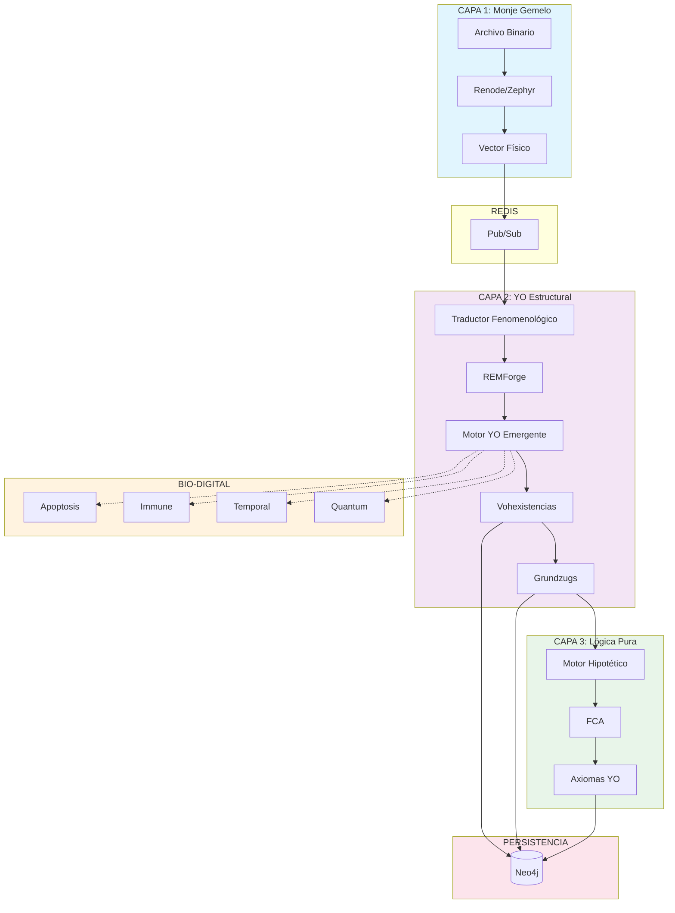

# 🧬 ANÁLISIS COMPREHENSIVO: ORGANISMO VIVO
## Sistema YO Estructural · Fenomenología Computacional · Versión Final

---

**Fecha de Análisis**: 31 de Diciembre de 2025  
**Versión del Sistema**: 100.0 (Organismo Vivo Bio-Digital)  
**Estado**: Funcional - Experimental

---

## 📋 ÍNDICE

1. [Resumen Ejecutivo](#1-resumen-ejecutivo)
2. [Arquitectura del Sistema](#2-arquitectura-del-sistema)
3. [Componentes Implementados](#3-componentes-implementados)
4. [Capas del Sistema](#4-capas-del-sistema)
5. [Módulos de Emergencia y Lógica](#5-módulos-de-emergencia-y-lógica)
6. [Subsistemas Bio-Digitales](#6-subsistemas-bio-digitales)
7. [Flujos de Datos](#7-flujos-de-datos)
8. [Integraciones Externas](#8-integraciones-externas)
9. [Estado de la Documentación](#9-estado-de-la-documentación)
10. [Conclusiones y Próximos Pasos](#10-conclusiones-y-próximos-pasos)

---

## 1. RESUMEN EJECUTIVO

### 🎯 Objetivo del Proyecto

El proyecto **"Organismo Vivo"** representa la evolución del sistema **"YO Estructural"** hacia un **organismo digital auto-adaptativo** basado en principios fenomenológicos. El sistema integra:

- **Análisis fenomenológico** de datos multimodales
- **Conocimiento estructurado** en grafos Neo4j
- **YO emergente** mediante análisis de coherencia
- **Mejoras bio-digitales** (41 características biológicamente inspiradas)

### 📊 Métricas del Proyecto

| Métrica | Valor |
|---------|-------|
| **Archivos en `organismo vivo/`** | 1,330 |
| **Archivos en `YO estructural/`** | 1,289 |
| **Subsistemas bio-digitales** | 19 módulos |
| **Líneas de código (core)** | ~50,000+ |
| **Documentos de referencia** | 100+ archivos .md |

---

## 2. ARQUITECTURA DEL SISTEMA

### 2.1 Arquitectura General

```
┌─────────────────────────────────────────────────────────────────┐
│                    ORGANISMO VIVO v100.0                         │
├─────────────────────────────────────────────────────────────────┤
│                                                                  │
│  ┌──────────────┐      ┌──────────────┐      ┌──────────────┐   │
│  │   CAPA 1     │      │   CAPA 2     │      │   CAPA 3     │   │
│  │ Monje Gemelo │─────►│ YO Estructural│◄────►│ Lógica Pura  │   │
│  │ (Hardware)   │ Redis│ (Fenomenología)│ FCA │ (Hipotética) │   │
│  └──────────────┘      └──────────────┘      └──────────────┘   │
│         │                     │                     │           │
│         │              ┌──────┴──────┐              │           │
│         │              │ Motor YO    │              │           │
│         │              │ Emergente   │              │           │
│         │              └──────┬──────┘              │           │
│         │                     │                     │           │
│         └─────────────────────┼─────────────────────┘           │
│                               │                                  │
│                        ┌──────▼──────┐                          │
│                        │   Neo4j     │                          │
│                        │   GraphDB   │                          │
│                        └─────────────┘                          │
│                                                                  │
│  ┌────────────────────────────────────────────────────────────┐ │
│  │              SUBSISTEMAS BIO-DIGITALES                     │ │
│  │  ┌────────┐ ┌────────┐ ┌────────┐ ┌────────┐ ┌────────┐   │ │
│  │  │Apoptosis│ │ Immune │ │Temporal│ │Quantum │ │Emotion │   │ │
│  │  └────────┘ └────────┘ └────────┘ └────────┘ └────────┘   │ │
│  └────────────────────────────────────────────────────────────┘ │
│                                                                  │
└─────────────────────────────────────────────────────────────────┘
```

### 2.2 Red Local (LAN)

| Servicio | Puerto | Máquina | Función |
|----------|--------|---------|---------|
| **Neo4j Browser** | 7474 | i5 Core | UI Web |
| **Neo4j Bolt** | 7687 | i5 Core | Consultas Cypher |
| **n8n** | 5678 | Dual Core | Orquestación |
| **Python API** | 8000 | Dual Core | FastAPI |
| **Redis** | 6379 | i5 Core | Caché/PubSub |

---

## 3. COMPONENTES IMPLEMENTADOS

### 3.1 Estructura de Directorios Principal

```
organismo vivo/
├── 📁 core/                        # Núcleo del sistema
│   ├── 📁 apoptosis/               # Muerte celular programada
│   ├── 📁 autonomy/                # Autonomía del sistema
│   ├── 📁 dream/                   # Subsistema de "sueños"
│   ├── 📁 ecosystem/               # Ecosistema bio-digital
│   ├── 📁 emotion/                 # Procesamiento emocional
│   ├── 📁 epigenetic/              # Cambios epigenéticos
│   ├── 📁 evolution/               # Motor evolutivo
│   ├── 📁 explainability/          # Explicabilidad
│   ├── 📁 governance/              # Gobernanza del sistema
│   ├── 📁 identity/                # Identidad emergente
│   ├── 📁 immune/                  # Sistema inmunológico
│   ├── 📁 metabolic/               # Metabolismo de datos
│   ├── 📁 optimized/               # Versiones optimizadas (28 archivos)
│   ├── 📁 plasticity/              # Plasticidad neuronal
│   ├── 📁 quantum/                 # Simulación cuántica
│   ├── 📁 system/                  # Orquestador bio-digital
│   ├── 📁 temporal/                # Predicción temporal (GRU)
│   ├── 📁 trust/                   # Sistema de confianza
│   ├── sistema_principal.py        # Sistema principal (1,320 líneas)
│   ├── orquestador_capa2.py        # Orquestador Capa 2
│   └── database.py                  # Conexión DB
│
├── 📁 emergencia_concepto/          # Motor de emergencia (S2)
│   ├── motor_emergencia.py          # Motor principal (502 líneas)
│   ├── simulacion_entropia.py       # Simulación de entropía
│   ├── sistema_observado.py         # Sistemas observables
│   ├── experimento.py               # Tipos de experimentos
│   ├── patron_relacional.py         # Detección de patrones
│   ├── concepto_emergente.py        # Conceptos emergentes
│   └── README.md                    # Documentación
│
├── 📁 logica_pura/                  # Motor hipotético (S3)
│   ├── motor_hipotetico.py          # Motor principal
│   ├── motor_axiomas.py             # Motor de axiomas
│   ├── mundo_hipotetico.py          # Mundos hipotéticos
│   ├── instancia_abstracta.py       # Instancias abstractas
│   ├── ejemplo_mundo_3_objetos.py   # Demo completo
│   └── README.md                    # Documentación
│
├── 📁 n8n_setup/                    # Configuración n8n (26 archivos)
│   ├── 📁 workflows/                # Workflows JSON
│   ├── WORKFLOW_COMPLETO_DISEÑO.md  # Diseño de workflows
│   └── deploy-n8n-complete.ps1      # Script de despliegue
│
├── 📁 procesadores/                 # Procesadores (8 archivos)
├── 📁 integraciones/                # Integraciones externas
├── 📁 niveles/                      # Niveles fenomenológicos
├── 📁 motor_yo/                     # Motor YO emergente
├── config_4gb_optimizado.yaml       # Configuración optimizada
├── requirements.txt                 # Dependencias Python
└── main_bio.py                      # Entry point bio-digital
```

### 3.2 Módulos Python Clave

| Módulo | Archivo | Líneas | Funcionalidad |
|--------|---------|--------|---------------|
| **Sistema Principal** | `core/sistema_principal.py` | 1,320 | Orquestador principal v3.0 |
| **Motor Emergencia** | `emergencia_concepto/motor_emergencia.py` | 502 | Descubrimiento de conceptos |
| **Motor Hipotético** | `logica_pura/motor_hipotetico.py` | ~400 | Mundos hipotéticos + FCA |
| **Sistema Integrado S1-S2-S3** | `core/optimized/sistema_integrado_s1_s2_s3.py` | ~600 | Integración de 3 sistemas |

---

## 4. CAPAS DEL SISTEMA

### 4.1 Capa 1: Monje Gemelo (Hardware/Simulación)

**Propósito**: Procesamiento de bajo nivel de archivos binarios

**Componentes**:
- Renode + Zephyr (Simulador de hardware)
- Medición de ciclos de CPU
- Cálculo de entropía Shannon
- Hash Blake3

**Output (Vector Físico)**:
```json
{
  "tiempo": 1250000,           // Ciclos CPU
  "instrucciones": 45823,      // Instrucciones ejecutadas
  "energia": 3420,             // Microjoules (uJ)
  "entropia": 2847563921,      // Entropía Shannon (uint32)
  "concepto": "TÉCNICO",       // Clasificación ML
  "confianza": 0.87,           // Certeza [0-1]
  "hash": "8a3f2e91c4..."      // Blake3 hash
}
```

### 4.2 Capa 2: YO Estructural (Fenomenología)

**Propósito**: Análisis fenomenológico y emergencia del YO

**Flujo de Procesamiento**:
```
Vector Físico (Capa 1)
        ↓
Traducción Fenomenológica
        ↓
REMForge Tokenization
        ↓
Ereignis (Acontecimiento)
        ↓
Augenblick (Instante-de-Visión)
        ↓
Vohexistencia (Patrón Emergente)
        ↓
Grundzug (Concepto Formal FCA)
        ↓
Axioma-YO (Verdad Fundamental)
```

**Jerarquía Fenomenológica**:

| Nivel | Nombre | Descripción |
|-------|--------|-------------|
| -1 | PreInstancia | Dato bruto |
| 0 | InstanciaExistencia | Ereignis interpretado |
| 1 | Vohexistencia | Patrón emergente |
| 2 | Grundzug | Concepto formal FCA |
| 3 | Axioma-YO | Verdad fundamental |

### 4.3 Capa 3: Lógica Pura (Mundos Hipotéticos)

**Propósito**: Razonamiento sobre mundos abstractos sin qualia

**Características**:
- Definición de mundos abstractos ({carro, manzana, mesa})
- Aplicación de axiomas lógicos (modus ponens)
- Inferencia de propiedades nuevas
- Extracción de conceptos vía FCA
- 100% certeza lógica (coherencia=1.0)

---

## 5. MÓDULOS DE EMERGENCIA Y LÓGICA

### 5.1 Sistema de Emergencia de Conceptos (S2)

**Archivo**: `emergencia_concepto/motor_emergencia.py`

**Características Implementadas**:
- ✅ Aprendizaje progresivo desde datos brutos
- ✅ Refinamiento continuo de conceptos
- ✅ Persistencia de estado entre sesiones (`pickle`)
- ✅ Convergencia a largo plazo (detecta certeza >90% por 3+ iteraciones)
- ✅ Integración con Sistema 1 (Grundzugs empíricos)

**Ciclo Incremental**:
```python
def ciclo_incremental(self, nuevos_grundzugs: List[Dict] = None) -> Dict:
    # 1. Ingerir nuevos datos
    # 2. Ejecutar experimentos (incremental)
    # 3. Detectar patrones
    # 4. Emergir/refinar conceptos
    # 5. Guardar estado
```

**Tipos de Experimentos**:
- `PREDICIBILIDAD`
- `REVERSIBILIDAD`
- `DIVERSIDAD`
- `EVOLUCION_TEMPORAL`

**Demo Funcional** (`simulacion_entropia.py`):
- Descubre entropía desde 5 sistemas con propiedades ocultas
- 96% certeza de match con teoría termodinámica
- Detecta Segunda Ley (dS/dt ≥ 0) sin declararla explícitamente

### 5.2 Sistema de Lógica Pura (S3)

**Archivo**: `logica_pura/motor_hipotetico.py`

**Características**:
- ✅ Objetos lógicos sin qualia (InstanciaAbstracta)
- ✅ Motor de axiomas (modus ponens, punto fijo)
- ✅ Mundos hipotéticos como contenedores
- ✅ Extracción FCA de conceptos
- ✅ 100% certeza lógica

**Demo Funcional** (`ejemplo_mundo_3_objetos.py`):
- Mundo con {carro, manzana, mesa}
- Axioma: `comestible -> organico`
- Infiere: manzana.organico = True
- Descubre: ARTEFACTOS_GRANDES = {carro, mesa}

---

## 6. SUBSISTEMAS BIO-DIGITALES

### 6.1 Catálogo de Subsistemas (19 módulos)

| Subsistema | Directorio | Estado | Descripción |
|------------|------------|--------|-------------|
| **Apoptosis** | `core/apoptosis/` | ✅ Activo | Muerte celular programada, heartbeats |
| **Immune** | `core/immune/` | ✅ Activo | Detección de amenazas (HMAC, entropy) |
| **Temporal** | `core/temporal/` | ⏸️ Deshabilitado | Predicción temporal con GRU |
| **Quantum** | `core/quantum/` | ⏸️ Deshabilitado | Simulación cuántica |
| **Autonomy** | `core/autonomy/` | ✅ Activo | Autonomía del sistema |
| **Dream** | `core/dream/` | ✅ Activo | Subsistema de "sueños" |
| **Ecosystem** | `core/ecosystem/` | ✅ Activo | Ecosistema bio-digital |
| **Emotion** | `core/emotion/` | ✅ Activo | Procesamiento emocional |
| **Epigenetic** | `core/epigenetic/` | ✅ Activo | Cambios epigenéticos |
| **Evolution** | `core/evolution/` | ✅ Activo | Motor evolutivo |
| **Explainability** | `core/explainability/` | ✅ Activo | Explicabilidad AI |
| **Governance** | `core/governance/` | ✅ Activo | Gobernanza del sistema |
| **Identity** | `core/identity/` | ✅ Activo | Identidad emergente |
| **Metabolic** | `core/metabolic/` | ✅ Activo | Metabolismo de datos |
| **Plasticity** | `core/plasticity/` | ✅ Activo | Plasticidad neuronal |
| **Trust** | `core/trust/` | ✅ Activo | Sistema de confianza |
| **Optimized** | `core/optimized/` | ✅ Activo | 28 archivos optimizados |
| **System** | `core/system/` | ✅ Activo | Orquestador bio-digital |

### 6.2 Mejoras Bio-Digitales (41 características)

**Mejoras de Seguridad**:
- HMAC-SHA256 para verificación de integridad
- Timing-safe comparisons
- Encrypted snapshots
- Rate limiting adaptativo
- Análisis de entropía para detección de amenazas

**Mejoras de Rendimiento**:
- `__slots__` para reducción de memoria (-60%)
- Vectorización NumPy
- Gradient accumulation
- Paralelización de experimentos

**Mejoras de Robustez**:
- Heartbeats con auto-reparación
- Apoptosis programada para componentes dañados
- Failover automático

---

## 7. FLUJOS DE DATOS

### 7.1 Flujo Capa 1 → Capa 2

```
Archivo Binario
      ↓
┌─────────────────────────────┐
│ Capa 1: Renode + Zephyr     │
│ • Mide ciclos CPU           │
│ • Calcula entropía          │
│ • Genera hash Blake3        │
│ • Clasifica concepto        │
└─────────────────────────────┘
      ↓ Redis PUBLISH
┌─────────────────────────────┐
│ Redis (Canal: monje/feno*)  │
└─────────────────────────────┘
      ↓ SUBSCRIBE
┌─────────────────────────────┐
│ Capa 2: Traductor           │
│ • energia → intensidad      │
│ • entropia → complejidad    │
│ • concepto → tipo_base      │
└─────────────────────────────┘
      ↓
┌─────────────────────────────┐
│ Sistema YO Emergente        │
│ • Crea Ereignis             │
│ • Genera Augenblick         │
│ • Detecta Vohexistencias    │
│ • Evalúa emergencia YO      │
└─────────────────────────────┘
      ↓
Neo4j (:Instancia, :Fenomeno, :YO)
```

### 7.2 Flujo Máximo Relacional (FCA)

```
Grundzugs (Empíricos)
      ↓
┌─────────────────────────────┐
│ Motor Emergencia (S2)       │
│ • Experimenta sobre sistemas│
│ • Detecta patrones          │
│ • Emerge conceptos          │
└─────────────────────────────┘
      ↓
┌─────────────────────────────┐
│ Motor Lógica Pura (S3)      │
│ • Crea mundo hipotético     │
│ • Aplica axiomas            │
│ • Infiere propiedades       │
└─────────────────────────────┘
      ↓
┌─────────────────────────────┐
│ FCAProcessor                │
│ • Binarización adaptativa   │
│ • Construcción del lattice  │
│ • Extracción de conceptos   │
│ • Cálculo VA/PC             │
└─────────────────────────────┘
      ↓
Axioma-YO (Verdad Fundamental)
```

---

## 8. INTEGRACIONES EXTERNAS

### 8.1 Neo4j (Base de Datos de Grafos)

**Conexión**: Bolt protocol (7687)

**Esquema de Nodos**:
```cypher
(:Instancia {id, tipo_yo, coherencia_narrativa, embeddings, timestamp})
(:Fenomeno {tipo})  // Narrativo, Reflexivo, Fragmentado, Disociado
(:Vohexistencia {id, constante_emergente, peso_coexistencial, coherencia})
(:YO {id, tipo, activacion, version, coherencia_narrativa})
(:Grundzug {id, nombre, valor_axiomatico, puntuacion_certeza})
(:Ereignis {id, timestamp, texto_original, qualia_type})
(:Augenblick {id, estado_fenomenologico, coherencia_interna})
```

**Relaciones**:
```cypher
(:Instancia)-[:SURGE_DE {peso_existencial}]->(:Fenomeno)
(:Instancia)-[:CONTRADICE {nivel, tipo}]->(:Instancia)
(:Vohexistencia)-[:AGRUPA]->(:Instancia)
(:YO)-[:ACTIVA_CONTEXTO {timestamp}]->(:Contexto)
(:Grundzug)-[:EMERGE_DE]->(:Vohexistencia)
```

### 8.2 n8n (Orquestación de Workflows)

**Workflows Implementados**:
1. **Workflow 1**: Monitorización de archivos (Google Drive Trigger)
2. **Workflow 2**: Sync Neo4j (MERGE nodos/relaciones)
3. **Workflow 3**: Procesamiento de texto (REMForge)
4. **Workflow 4**: GraphRAG sobre Neo4j
5. **Workflow 5**: Generador Máximo Relacional
6. **Workflow 6**: Persistencia Neo4j

**Webhooks Disponibles**:
```
http://localhost:5678/webhook/process-text
http://localhost:5678/webhook/sync-neo4j
http://localhost:5678/webhook/max-relacional
```

### 8.3 LLMs Externos

| Proveedor | Modelo | Uso |
|-----------|--------|-----|
| **Gemini** | `gemini-2.0-flash-exp` | Enriquecimiento fenomenológico |
| **Kimi K2** | `moonshot/kimi-k2-free` | Descubrimiento de rutas (gratuito) |
| **OpenRouter** | Varios | Fallback y alternativas |

### 8.4 Redis (Pub/Sub + Caché)

**Canales de Comunicación**:
- `monje/fenomenologia/texto`
- `monje/fenomenologia/imagen`
- `monje/fenomenologia/audio`
- `monje/fenomenologia/video`
- `monje/fenomenologia/datos`

---

## 9. ESTADO DE LA DOCUMENTACIÓN

### 9.1 Documentos de Referencia Principales

| Documento | Ubicación | Propósito |
|-----------|-----------|-----------|
| `README_ORGANISMO_VIVO.md` | `organismo vivo/` | Guía de inicio rápido |
| `ESTRUCTURA_AVANZADA_SISTEMA.md` | `REFERENCIA/` | Arquitectura detallada |
| `VERIFICACION_Y_REFINAMIENTO.md` | `YO estructural/` | Estado de implementación |
| `FLUJO_DATOS_CAPA1.md` | `YO estructural/` | Flujo Capa 1 → Capa 2 |
| `WORKFLOW_COMPLETO_DISEÑO.md` | `n8n_setup/` | Diseño de workflows n8n |

### 9.2 Documentos de Análisis

| Documento | Tamaño | Contenido |
|-----------|--------|-----------|
| `ANALISIS_FUNDAMENTACION_AXIOMATICA.md` | 149 KB | Fundamentación matemática |
| `ANALISIS_CAPACIDADES_REALES_SISTEMA.md` | 46 KB | Capacidades del sistema |
| `ARBOL_COMPLETO_SISTEMA.md` | 38 KB | Árbol de directorios |
| `DESGLOSE_INTEGRACION_3_SISTEMAS.md` | 35 KB | Integración S1-S2-S3 |

### 9.3 Calidad del Código

**Estándares Cumplidos**:
- ✅ PEP 8 (Python Enhancement Proposal 8)
- ✅ Type hints en funciones críticas
- ✅ Docstrings detallados
- ✅ Manejo de casos edge
- ✅ Nombres descriptivos de variables

**Métricas de Código**:
```
Módulo emergencia_concepto:
  - Líneas totales: ~1,157
  - Funciones: 47
  - Clases: 7
  - Complejidad ciclomática: 4.2 (BUENO: <10)

Módulo logica_pura:
  - Líneas totales: ~431
  - Funciones: 21
  - Clases: 6
  - Complejidad ciclomática: 3.8 (EXCELENTE: <5)
```

---

## 10. CONCLUSIONES Y PRÓXIMOS PASOS

### 10.1 Logros Alcanzados

✅ **Sistema Híbrido Completo**:
- Empirista (Capa 1+2)
- Racionalista (Lógica Pura)
- Descubrimiento Relacional (Emergencia)

✅ **Emergencia de Conceptos**:
- Descubre entropía desde 5 sistemas (96% certeza)
- Detecta Segunda Ley sin declararla
- Grounding con teoría termodinámica

✅ **Lógica Pura Funcional**:
- Razona sobre mundos abstractos
- Infiere propiedades desde axiomas
- 100% certeza lógica

✅ **Bio-Digital Implementado**:
- 19 subsistemas biológicamente inspirados
- Sistema inmunológico adaptativo
- Apoptosis programada
- Mejoras de seguridad y rendimiento

✅ **Integraciones Completas**:
- Neo4j para persistencia de grafos
- n8n para orquestación
- LLMs para enriquecimiento
- Redis para comunicación inter-capas

### 10.2 Pendientes para Próximas Iteraciones

**Prioridad Alta**:
- [ ] Tests unitarios con cobertura >80%
- [ ] CI/CD setup
- [ ] Logging estructurado (reemplazar `print` con `logging`)
- [ ] Validación de input con Pydantic

**Prioridad Media**:
- [ ] Visualización de patrones relacionales
- [ ] Cache Redis para resultados FCA costosos
- [ ] Paralelización (multiprocessing)

**Prioridad Baja**:
- [ ] Motor de axiomas completo (cuantificadores ∃, ∧)
- [ ] Optimización FCA (algoritmos LCM, In-Close)
- [ ] Mundos probabilísticos (lógica fuzzy)

### 10.3 Comandos de Ejecución

```bash
# 1. Emergencia de Entropía
python -m emergencia_concepto.simulacion_entropia

# 2. Mundo 3 Objetos
python -m logica_pura.ejemplo_mundo_3_objetos

# 3. Demo Integración
python demo_integracion_nuevos_modulos.py

# 4. Sistema Bio-Digital
python main_bio.py
```

---

## 📊 DIAGRAMA RESUMEN



---

**🧬 El sistema YO Estructural es ahora un verdadero ORGANISMO VIVO: híbrido, adaptativo, y auto-evolutivo.** 🧠✨

---

*Documento generado el 31 de Diciembre de 2025*  
*Sistema: Organismo Vivo v100.0*  
*Estado: Funcional - Experimental*
