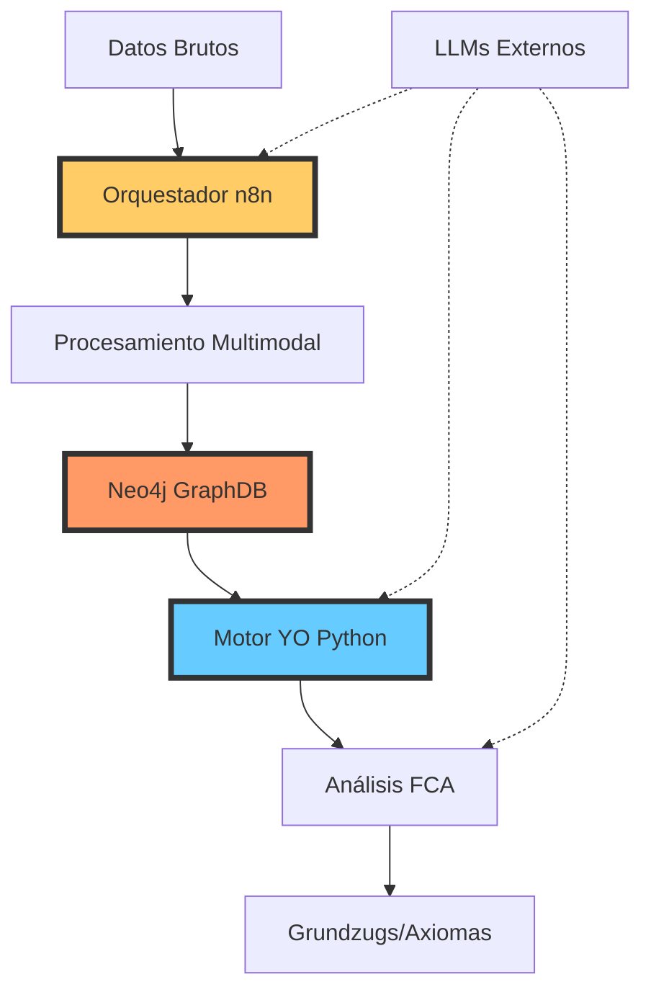
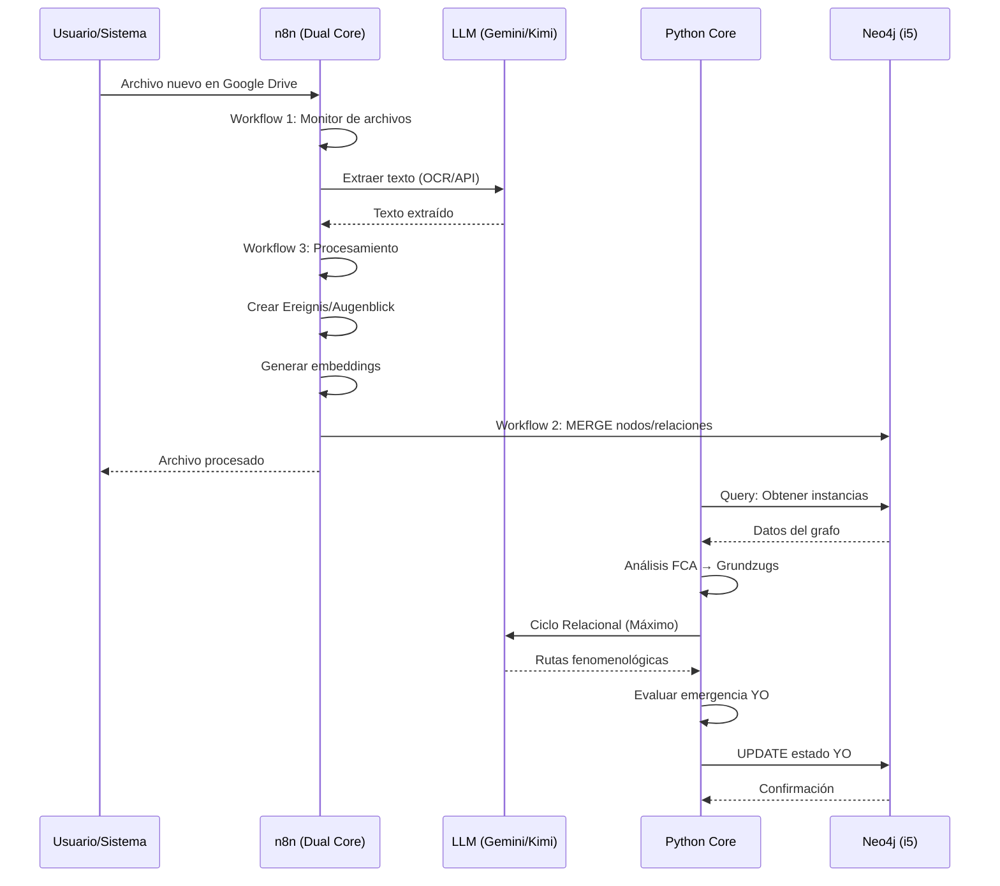

# ESTRUCTURA AVANZADA DETALLADA
## Sistema YO Estructural · Fenomenología Computacional v3.0

---

## 📋 Índice

1. [Visión General del Sistema](#visión-general-del-sistema)
2. [Arquitectura de Red Local (LAN)](#arquitectura-de-red-local-lan)
3. [Componentes del Sistema](#componentes-del-sistema)
4. [Flujos de Datos](#flujos-de-datos)
5. [Esquema de Base de Datos Neo4j](#esquema-de-base-de-datos-neo4j)
6. [Jerarquía Fenomenológica](#jerarquía-fenomenológica)
7. [APIs y Endpoints](#apis-y-endpoints)
8. [Integración con LLMs](#integración-con-llms)
9. [Configuración y Despliegue](#configuración-y-despliegue)
10. [Seguridad](#seguridad)

---

## 1. Visión General del Sistema

### 1.1 Objetivo
Sistema de análisis fenomenológico y relacional que:
- Procesa textos multimodales
- Genera conocimiento estructurado
- Evoluciona un "YO emergente" mediante análisis de coherencia
- Alcanza el "Máximo Relacional" de conceptos

### 1.2 Principios Arquitectónicos


---

## 2. Arquitectura de Red Local (LAN)

### 2.1 Topología de Red

```
┌─────────────────────────────────────────────────────────────┐
│                    RED LOCAL (LAN 192.168.1.x)              │
├─────────────────────────────────────────────────────────────┤
│                                                              │
│  ┌────────────────────┐         ┌────────────────────┐     │
│  │   i5 Core          │         │   Dual Core        │     │
│  │   (Docker/WSL)     │◄────────┤   (PowerShell)     │     │
│  │                    │  Bolt   │                    │     │
│  │  Neo4j 5.15        │  :7687  │  n8n :5678         │     │
│  │  • Grafos          │         │  • Orquestación    │     │
│  │  • GDS             │         │  • Workflows       │     │
│  │  • Vector Search   │         │  • Webhooks        │     │
│  │                    │         │                    │     │
│  │  IP: 192.168.1.50  │         │  Python Core       │     │
│  └────────────────────┘         │  • Motor YO        │     │
│                                  │  • FCA             │     │
│                                  │  • REMForge        │     │
│                                  └────────────────────┘     │
│                                                              │
└─────────────────────────────────────────────────────────────┘
```

### 2.2 Puertos y Servicios

| Servicio | Puerto | Máquina | Protocolo | Función |
|----------|--------|---------|-----------|---------|
| Neo4j Browser | 7474 | i5 Core | HTTP | UI Web |
| Neo4j Bolt | 7687 | i5 Core | Bolt | Consultas |
| n8n | 5678 | Dual Core | HTTP/WS | Orquestación |
| Python API | 8000 | Dual Core | HTTP | FastAPI |
| Redis | 6379 | i5 Core | TCP | Caché |
| Prometheus | 9090 | i5 Core | HTTP | Métricas |
| Grafana | 3000 | i5 Core | HTTP | Dashboards |

---

## 3. Componentes del Sistema

### 3.1 Estructura de Directorios

```
YO estructural/
├── 📁 motor_yo/
│   ├── sistema_yo_emergente.py       # Core: Motor YO
│   ├── mdce_detector.py               # Detector de contradicciones
│   └── tipos_yo.py                    # Enum de tipos de YO
│
├── 📁 niveles/
│   ├── preinstancia.py                # Nivel -1
│   ├── instancia_existencia.py        # Nivel 0
│   ├── vohexistencia.py               # Nivel 1
│   └── grundzug.py                    # Nivel 2
│
├── 📁 procesadores/
│   ├── gemini_integration.py          # SDK Gemini
│   ├── generador_rutas_fenomenologicas.py
│   ├── analizador_maximo_relacional_hibrido.py
│   └── fca_processor.py               # Formal Concept Analysis
│
├── 📁 REm/
│   ├── remforge_ultra_formato_optimo.py
│   └── tokenizador_fenomenologico.py
│
├── 📁 n8n_setup/
│   ├── workflows/
│   │   ├── workflow_1_monitor_archivos.json
│   │   ├── workflow_2_sync_neo4j.json
│   │   ├── workflow_3_text_processing.json
│   │   └── workflow_5_generador_maximo_relacional.json
│   ├── deploy-n8n-complete.ps1
│   └── SETUP_GUIDE.md
│
├── 📁 integraciones/
│   ├── n8n_config.py                  # Bridge Python↔n8n
│   └── neo4j_connection.py
│
├── 📁 entrada_bruta/                  # Input: Raw data
├── 📁 procesado/                      # Output: Processed
├── 📁 logs_sistema/                   # Logs
├── 📁 diagnosticos_sistema_*/         # Diagnostic snapshots
│
├── sistema_principal_v2.py            # Main orchestrator
├── ciclo_relacional_kimi_openrouter.py
├── integracion_neo4j_gemini.py
├── api_neo4j_gemini.js                # Node.js API
├── docker-compose.yml
├── requirements.txt
└── .env                               # Credentials
```

### 3.2 Módulos Python Clave

#### 3.2.1 `sistema_principal_v2.py`
```python
class SistemaFenomenologicoV2:
    """Sistema principal integrado v2.2"""
    
    def __init__(self, config_path: str):
        self.config = self._cargar_config(config_path)
        self.procesador_textos = ProcesadorFenomenologico()
        self.sistema_gradientes = VohexGradientSystem()
        self.neo4j = Neo4jConnection(...)
        self.motor_yo = SistemaYoEmergente(...)
    
    def procesar_flujo_completo(self, ruta_datos_entrada: str) -> Dict:
        """Ejecuta el flujo completo del sistema"""
        # 1. Procesar textos
        # 2. Generar preinstancias
        # 3. Crear instancias de existencia
        # 4. Activar MDCE si hay contradicciones
        # 5. Calcular gradientes relacionales
        # 6. Detectar vohexistencias
        # 7. Evaluar emergencia del YO
        # 8. Sincronizar con Neo4j
```

#### 3.2.2 `motor_yo/sistema_yo_emergente.py`
```python
class SistemaYoEmergente:
    """Motor de emergencia del YO con soporte Neo4j"""
    
    def evaluar_emergencia(self, contextos: List, fenomenos: List) -> bool:
        """Evalúa si emerge un nuevo nivel de YO"""
        coherencia = self._calcular_coherencia(contextos)
        tipo_yo = self._actualizar_tipo_yo(coherencia)
        self._sincronizar_con_neo4j()
        return tipo_yo.value >= 3
    
    def evaluar_contradicciones(self, estado_actual: dict) -> dict:
        """Evalúa contradicciones de 4° orden (MDCE)"""
        tensiones = self._detectar_tensiones_estructurales(estado_actual)
        return {
            "requiere_reconfig": len(tensiones) > self.umbral_mdce,
            "tensiones": tensiones
        }
    
    def activar_reconfiguracion(self, contradicciones: dict) -> dict:
        """Activa el ciclo de reconfiguración MDCE"""
        # Reconfigura estructuras fenomenológicas
        # Reasigna pesos relacionales
        # Actualiza coherencia narrativa
```

#### 3.2.3 `procesadores/fca_processor.py`
```python
class FCAProcessor:
    """Procesador de Análisis Formal de Conceptos"""
    
    def extraer_grundzugs(self, vohexistencias: List[Vohexistencia]) -> List[Grundzug]:
        """Extrae conceptos formales (Grundzugs) de vohexistencias"""
        # Binarización adaptativa
        # Construcción del lattice
        # Extracción de conceptos formales
        # Cálculo de VA/PC (Valor Axiomático / Puntuación Certeza)
```

---

## 4. Flujos de Datos

### 4.1 Pipeline Principal



### 4.2 Workflow 1: Monitorización de Archivos

```javascript
// workflow_1_monitor_archivos.json
{
  "nodes": [
    {
      "name": "Google Drive Trigger",
      "type": "n8n-nodes-base.googleDriveTrigger",
      "parameters": {
        "driveId": "my-drive",
        "event": "fileCreatedOrUpdated"
      }
    },
    {
      "name": "Call Workflow 3",
      "type": "n8n-nodes-base.httpRequest",
      "parameters": {
        "url": "http://localhost:5678/webhook/process-text",
        "method": "POST"
      }
    }
  ]
}
```

### 4.3 Workflow 2: Sync Neo4j

```cypher
// Sincronización idempotente
MERGE (i:Instancia {doc_id: $docID})
SET i.texto_fenomenologico = $texto_fenomenologico, 
    i.metrica_yo = toFloat($metrica_yo),
    i.fecha = datetime(),
    i.embeddings = $embeddings

MERGE (f:Fenomeno {tipo: $tipo_fenomeno})
MERGE (i)-[:SURGE_DE {peso_existencial: toFloat($metrica_yo)}]->(f)

// GraphRAG: Búsqueda vectorial + relacional
CALL db.index.vector.queryNodes('embeddings_index', 10, $query_vector)
YIELD node, score
MATCH (node)-[:SURGE_DE]->(f:Fenomeno)
RETURN node, f, score
ORDER BY score DESC
```

### 4.4 Workflow 3: Text Processing

```javascript
// Nodo: Fenomenología Tridimensional
const { ereignis, augenblick } = items.json;

const binarizacion = {
  augenblick_id: augenblick.id,
  atributos_binarios: {
    es_coherente: augenblick.propiedades_emergentes.coherencia_interna > 0.7,
    es_complejo: augenblick.propiedades_emergentes.complejidad_semantica > 0.5,
    es_intencional: augenblick.propiedades_emergentes.intencionalidad === 'directa'
  },
  incertidumbre_binarios: {
    es_coherente: 0.85,
    es_complejo: 0.72,
    es_intencional: 0.90
  }
};

return [{ json: { ereignis, augenblick, binarizacion } }];
```

---

## 5. Esquema de Base de Datos Neo4j

### 5.1 Nodos Principales

```cypher
// Tipos de Nodos
(:Instancia {
  doc_id: STRING,
  texto_fenomenologico: STRING,
  metrica_yo: FLOAT,
  embeddings: LIST<FLOAT>,
  fecha: DATETIME
})

(:Fenomeno {
  tipo: STRING // 'Narrativo', 'Reflexivo', 'Fragmentado', 'Disociado'
})

(:Vohexistencia {
  id: STRING,
  constante_emergente: STRING,
  peso_coexistencial: FLOAT,
  coherencia: FLOAT
})

(:YO {
  id: STRING,
  tipo: STRING,
  activacion: FLOAT,
  timestamp: DATETIME,
  version: INT,
  coherencia_narrativa: FLOAT,
  estabilidad_contextual: FLOAT,
  integracion_afectiva: FLOAT
})

(:Contexto {
  id: STRING,
  propiedades: MAP
})

(:Grundzug {
  id: STRING,
  nombre: STRING,
  valor_axiomatico: FLOAT,
  puntuacion_certeza: FLOAT
})
```

### 5.2 Relaciones

```cypher
(:Instancia)-[:SURGE_DE {peso_existencial: FLOAT}]->(:Fenomeno)
(:Instancia)-[:CONTRADICE {nivel: INT, tipo: STRING}]->(:Instancia)
(:Vohexistencia)-[:AGRUPA]->(:Instancia)
(:YO)-[:ACTIVA_CONTEXTO {timestamp: DATETIME}]->(:Contexto)
(:YO)-[:ACTUA_EN {peso: FLOAT}]->(:Fenomeno)
(:Grundzug)-[:EMERGE_DE]->(:Vohexistencia)
```

### 5.3 Índices

```cypher
// Índices de búsqueda
CREATE INDEX instancia_docid FOR (i:Instancia) ON (i.doc_id);
CREATE INDEX fenomeno_tipo FOR (f:Fenomeno) ON (f.tipo);
CREATE INDEX yo_timestamp FOR (y:YO) ON (y.timestamp);

// Índice vectorial para GraphRAG
CREATE VECTOR INDEX embeddings_index
FOR (i:Instancia) ON (i.embeddings)
OPTIONS {
  indexConfig: {
    `vector.dimensions`: 1536,
    `vector.similarity_function`: 'cosine'
  }
};
```

---

## 6. Jerarquía Fenomenológica

### 6.1 Niveles de Abstracción

```
Nivel -1: PreInstancia (Dato Bruto)
   ↓
Nivel 0: InstanciaExistencia (Ereignis interpretado)
   ↓
Nivel 1: Vohexistencia (Patrón emergente)
   ↓
Nivel 2: Grundzug (Concepto formal FCA)
   ↓
Nivel 3: Axioma-YO (Verdad fundamental)
```

### 6.2 Transformaciones

```python
# PreInstancia → InstanciaExistencia
def crear_instancia_desde_preinstancia(preinstancia: PreInstancia) -> InstanciaExistencia:
    propiedades = {
        'nivel_jerarquico': preinstancia.dato_crudo['nivel_jerarquico'],
        'contenido': preinstancia.dato_crudo['contenido'],
        'confianza': preinstancia.dato_crudo['confianza']
    }
    return InstanciaExistencia(propiedades=propiedades)

# InstanciaExistencia → Vohexistencia
def detectar_vohexistencias(instancias: List[InstanciaExistencia]) -> List[Vohexistencia]:
    # Clustering por gradientes relacionales
    # Umbral de coexistencia: > 0.7
    # Mínimo 2 instancias por vohex

# Vohexistencia → Grundzug
def extraer_grundzugs(vohexistencias: List[Vohexistencia]) -> List[Grundzug]:
    # FCA: Binarización adaptativa
    # Construcción del lattice
    # Extracción de conceptos con VA/PC
```

---

## 7. APIs y Endpoints

### 7.1 FastAPI (Python)

```python
# YO estructural/api_generador_maximo.py
from fastapi import FastAPI, HTTPException
from pydantic import BaseModel

app = FastAPI(title="YO Estructural API", version="3.0")

class ConceptoRequest(BaseModel):
    concepto: str
    usar_neo4j: bool = True
    usar_gemini: bool = True
    enviar_a_n8n: bool = False

@app.get("/")
async def root():
    return {
        "sistema": "YO Estructural v3.0",
        "componentes": ["Neo4j", "n8n", "Gemini"],
        "rutas_disponibles": ["/health", "/api/generador/rutas"]
    }

@app.get("/health")
async def health_check():
    return {
        "status": "healthy",
        "neo4j": await check_neo4j(),
        "n8n": await check_n8n(),
        "timestamp": datetime.now().isoformat()
    }

@app.post("/api/generador/rutas")
async def generar_rutas(request: ConceptoRequest):
    # Generar rutas fenomenológicas
    rutas = generador.generar_rutas(request.concepto)
    
    # Enriquecer con Gemini
    if request.usar_gemini:
        rutas = await gemini_enricher.analizar_convergencia(request.concepto, rutas)
    
    # Guardar en Neo4j
    if request.usar_neo4j and rutas["convergen"]:
        await neo4j.guardar_max imo_relacional(rutas)
    
    # Enviar a n8n
    if request.enviar_a_n8n:
        background_tasks.add_task(n8n.enviar_datos, rutas)
    
    return {
        "concepto": request.concepto,
        "rutas": rutas,
        "certeza_combinada": rutas["confianza"]
    }
```

### 7.2 Node.js Express API

```javascript
// api_neo4j_gemini.js
const express = require('express');
const neo4j = require('neo4j-driver');
const { GoogleGenerativeAI } = require("@google/generative-ai");

const app = express();

app.get('/health', async (req, res) => {
  const neo4jStatus = await checkNeo4j();
  const geminiStatus = await checkGemini();
  res.json({ neo4j: neo4jStatus, gemini: geminiStatus });
});

app.post('/neo4j/query', async (req, res) => {
  const { query, params } = req.body;
  const result = await neo4jSession.run(query, params);
  res.json(result.records.map(r => r.toObject()));
});

app.post('/gemini', async (req, res) => {
  const { prompt } = req.body;
  const model = genAI.getGenerativeModel({ model: "gemini-2.0-flash-exp" });
  const result = await model.generateContent(prompt);
  res.json({ text: result.response.text() });
});

app.listen(3000);
```

### 7.3 n8n Webhooks

```
http://localhost:5678/webhook/process-text       # Workflow 3
http://localhost:5678/webhook/sync-neo4j         # Workflow 2
http://localhost:5678/webhook/max-relacional     # Workflow 5
```

---

## 8. Integración con LLMs

### 8.1 Gemini (Google)

```python
# procesadores/gemini_integration.py
import google.generativeai as genai

class GeminiEnriquecedor:
    def __init__(self, api_key: str):
        genai.configure(api_key=api_key)
        self.model = genai.GenerativeModel(
            'gemini-2.0-flash-exp',
            generation_config={
                "temperature": 0.3,
                "max_output_tokens": 2048,
                "response_mime_type": "application/json"
            }
        )
    
    def analizar_convergencia(self, concepto: str, rutas: List[str]) -> dict:
        prompt = f"""
        Analiza la convergencia de las siguientes rutas fenomenológicas 
        para el concepto '{concepto}':
        
        {json.dumps(rutas, indent=2)}
        
        Responde en JSON con:
        - convergen: bool
        - razon: string
        - definicion_unificada: string
        - confianza: float (0-1)
        - recomendaciones: list
        """
        
        response = self.model.generate_content(prompt)
        return json.loads(response.text)
```

### 8.2 OpenRouter (Kimi K2)

```python
# ciclo_relacional_kimi_openrouter.py
import openai

client = openai.OpenAI(
    base_url="https://openrouter.ai/api/v1",
    api_key=os.getenv("OPENROUTER_API_KEY")
)

def descubrir_rutas_fenomenologicas(concepto: str, iteraciones: int = 3) -> dict:
    """Descubre rutas fenomenológicas usando Kimi K2 gratuito"""
    
    schema = {
        "type": "object",
        "properties": {
            "rutas": {
                "type": "array",
                "items": {
                    "type": "object",
                    "properties": {
                        "nombre": {"type": "string"},
                        "descripcion": {"type": "string"},
                        "nivel_profundidad": {"type": "integer"}
                    }
                }
            },
            "total_encontradas": {"type": "integer"}
        }
    }
    
    response = client.chat.completions.create(
        model="moonshot/kimi-k2-free",
        messages=[
            {"role": "system", "content": "Eres un experto en fenomenología."},
            {"role": "user", "content": f"Descubre 8-12 rutas fenomenológicas para: {concepto}"}
        ],
        extra_body={"response_format": {"type": "json_object", "schema": schema}}
    )
    
    return json.loads(response.choices[0].message.content)
```

---

## 9. Configuración y Despliegue

### 9.1 Docker Compose

```yaml
# docker-compose.yml
version: '3.8'

services:
  neo4j:
    image: neo4j:5.15-enterprise
    container_name: yo_neo4j
    ports:
      - "7474:7474"
      - "7687:7687"
    environment:
      - NEO4J_AUTH=neo4j/fenomenologia2024
      - NEO4J_PLUGINS=["graph-data-science", "apoc"]
      - NEO4JLABS_PLUGINS=["apoc"]
    volumes:
      - neo4j_data:/data
      - neo4j_logs:/logs
    networks:
      - yo_network

  n8n:
    image: n8nio/n8n:latest
    container_name: yo_n8n
    ports:
      - "5678:5678"
    environment:
      - N8N_HOST=localhost
      - NEO4J_HOST=neo4j
      - NEO4J_PORT=7687
      - NEO4J_USER=neo4j
      - NEO4J_PASSWORD=fenomenologia2024
    volumes:
      - n8n_data:/home/node/.n8n
    networks:
      - yo_network
    depends_on:
      - neo4j

  redis:
    image: redis:7-alpine
    container_name: yo_redis
    ports:
      - "6379:6379"
    networks:
      - yo_network

volumes:
  neo4j_data:
  neo4j_logs:
  n8n_data:

networks:
  yo_network:
    driver: bridge
```

### 9.2 PowerShell Deployment

```powershell
# deploy-n8n-complete.ps1
$NEO4J_HOST_IP = "192.168.1.50"  # IP estática i5 Core
$NEO4J_PORT_BOLT = 7687
$PROJECT_ROOT = "C:\Users\Public\#...Raíz Dasein\REFERENCIA\YO estructural"

# Configurar variables de entorno n8n
@'
N8N_HOST=localhost
N8N_PORT=5678
NEO4J_HOST={0}
NEO4J_PORT={1}
NEO4J_USER=neo4j
NEO4J_PASSWORD=fenomenologia2024
GOOGLE_GEMINI_API_KEY={2}
OpenROUTER_API_KEY={3}
LOCAL_DATA_PATH={4}\entrada_bruta
YAML_OUTPUT_PATH={4}\procesado\yamls
'@ -f $NEO4J_HOST_IP, $NEO4J_PORT_BOLT, $env:GEMINI_API_KEY, $env:OPENROUTER_API_KEY, $PROJECT_ROOT | 
   Out-File -FilePath "$env:USERPROFILE\.n8n\.env"

# Iniciar n8n
n8n start --env-file "$env:USERPROFILE\.n8n\.env"

# Importar workflows
Invoke-RestMethod -Uri "http://localhost:5678/api/v1/workflows/import" `
                  -Method POST `
                  -InFile "$PROJECT_ROOT\n8n_setup\workflows\workflow_1_monitor_archivos.json" `
                  -Headers @{"X-N8N-API-KEY" = $env:N8N_API_KEY}
```

### 9.3 Python Requirements

```txt
# requirements.txt
# Core
fastapi==0.115.0
uvicorn[standard]==0.32.0
pydantic==2.9.0

# Database
neo4j==6.0.2
redis==5.2.0

# ML/AI
google-generativeai==0.8.3
openai==1.54.0
transformers==4.47.0
torch==2.5.1
scikit-learn==1.6.0

# Data Processing
pandas==2.2.3
numpy==2.2.0
pyyaml==6.0.2
python-dotenv==1.0.1

# HTTP/Network
requests==2.32.3
httpx==0.28.0

# Testing
pytest==8.3.4
pytest-asyncio==0.24.0
```

---

## 10. Seguridad

### 10.1 Gestión de Secretos

```python
# config/secrets.py
from dotenv import load_dotenv
import os

load_dotenv()

class SecretManager:
    """Gestor centralizado de secretos"""
    
    @staticmethod
    def get_neo4j_credentials():
        return {
            "uri": os.getenv("NEO4J_URI"),
            "user": os.getenv("NEO4J_USER"),
            "password": os.getenv("NEO4J_PASSWORD")
        }
    
    @staticmethod
    def get_api_keys():
        return {
            "gemini": os.getenv("GOOGLE_GEMINI_API_KEY"),
            "openrouter": os.getenv("OPENROUTER_API_KEY"),
            "n8n": os.getenv("N8N_API_KEY")
        }
```

### 10.2 `.env.example`

```bash
# Neo4j Configuration
NEO4J_URI=bolt://192.168.1.50:7687
NEO4J_USER=neo4j
NEO4J_PASSWORD=your_strong_password_here

# LLM API Keys
GOOGLE_GEMINI_API_KEY=AIza...
OPENROUTER_API_KEY=sk-or-...

# n8n Configuration
N8N_HOST=localhost
N8N_PORT=5678
N8N_API_KEY=your_n8n_api_key

# Paths
LOCAL_DATA_PATH=C:\path\to\entrada_bruta
YAML_OUTPUT_PATH=C:\path\to\procesado\yamls
```

### 10.3 Recomendaciones

1. **NUNCA** commitear archivos `.env` a git
2. Rotar claves API cada 90 días
3. Usar autenticación JWT para APIs externas
4. Cifrar datos sensibles en Neo4j
5. Implementar rate limiting en endpoints públicos
6. Auditar accesos a base de datos
7. Usar HTTPS/TLS en producción

---

## Conclusión

Esta estructura avanzada proporciona una base sólida para:
- Despliegue reproducible en red local
- Escalabilidad horizontal (añadir más workers)
- Mantenibilidad (separación de concerns)
- Seguridad (gestión de secretos)
- Monitorización (logs, métricas)

El sistema está listo para:
✅ Procesamiento de textos multimodales  
✅ Análisis fenomenológico avanzado  
✅ Emergencia del YO mediante Machine Learning  
✅ Alcance del Máximo Relacional con LLMs  
✅ Integración con proyectos externos (mismo Neo4j)
