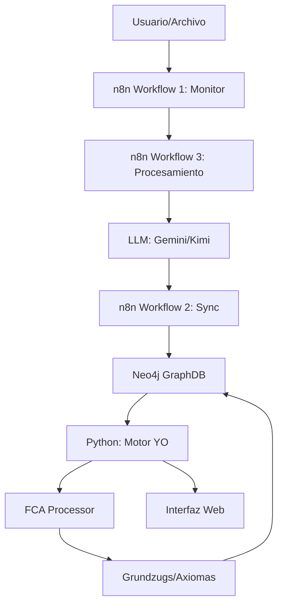

# YO Estructural · Fenomenología Computacional v3.0

## 📋 Documentación del Sistema

Este repositorio contiene la estructura avanzada completa del sistema YO Estructural, junto con una interfaz de usuario premium para monitoreo y control.

## 📁 Estructura de Archivos

```
REFERENCIA/
├── REFERENCIAS_ORDENADAS.md          # Referencias 1-40 del informe técnico
├── ESTRUCTURA_AVANZADA_SISTEMA.md    # Documentación técnica completa
├── index.html                         # Interfaz de usuario principal
├── styles.css                         # Estilos modernos con glassmorphism
├── script.js                          # Lógica de la interfaz
└── README.md                          # Este archivo
```

## 🎯 Características del Sistema

### 1. Referencias Ordenadas (REFERENCIAS_ORDENADAS.md)
Extracción completa de las 40 referencias numeradas del informe técnico, incluyendo:
- Fragmentos de código completos
- Descripciones de funcionalidad
- Ejemplos de uso
- Patrones de integración

### 2. Estructura Avanzada (ESTRUCTURA_AVANZADA_SISTEMA.md)
Documentación exhaustiva que incluye:

#### Arquitectura de Red Local (LAN)
- Topología de red con 2 máquinas (i5 Core + Dual Core)
- Puertos y servicios detallados
- Diagramas de conectividad

#### Componentes del Sistema
```
- Neo4j (i5 Core)      → Base de datos de grafos
- n8n (Dual Core)      → Motor de orquestación
- Python Core          → Motor YO + FCA
- LLMs Externos        → Gemini + Kimi K2
```

#### Flujos de Datos
- Pipeline principal completo
- 3 Workflows de n8n (fragmentos JSON)
- Consultas Cypher de sincronización
- Diagramas de secuencia

#### Esquema de Base de Datos Neo4j
- Tipos de nodos: Instancia, Fenómeno, Vohexistencia, YO, Contexto, Grundzug
- Relaciones: SURGE_DE, CONTRADICE, AGRUPA, ACTIVA_CONTEXTO, ACTUA_EN
- Índices vectoriales para GraphRAG

#### Jerarquía Fenomenológica
```
Nivel -1: PreInstancia
   ↓
Nivel 0: InstanciaExistencia
   ↓
Nivel 1: Vohexistencia
   ↓
Nivel 2: Grundzug
   ↓
Nivel 3: Axioma-YO
```

#### > [!IMPORTANT]
#### APIs y Endpoints
- **FastAPI (Python)**: `/`, `/health`, `/api/generador/rutas`
- **Node.js Express**: `/health`, `/neo4j/query`, `/gemini`
- **n8n Webhooks**: `/webhook/process-text`, `/webhook/sync-neo4j`

#### Integración con LLMs
- Google Gemini (SDK oficial)
- Kimi K2 via OpenRouter
- Schemas JSON estructurados

#### Configuración y Despliegue
- Docker Compose completo
- Scripts PowerShell
- Variables de entorno
- Requirements.txt

### 3. Interfaz de Usuario Premium (index.html + styles.css + script.js)

#### Características Visuales:
✨ **Diseño Moderno**
- Glassmorphism effects (fondo semi-transparente con blur)
- Gradientes vibrantes (primary: #667eea → secondary: #764ba2)
- Animaciones smooth (hover, pulse, slide-in)
- Responsive design (desktop → tablet → mobile)

🎨 **Componentes de UI:**

**Navbar**
- Logo animado con gradientes SVG
- Menú de navegación (Dashboard, Analytics, Workflows, Graph, Settings)
- Indicador de estado del sistema (Online/Offline con pulse animation)
- Botón de notificaciones con badge contador

**Sidebar**
- Menú de secciones (Overview, Métricas, MDCE Detector)
- Estado de componentes en tiempo real:
  - Neo4j ● (verde = activo)
  - n8n ● (verde = activo)
  - Motor YO ● (verde = activo)
  - FCA Processor ● (verde = activo)

**Stats Cards** (4 tarjetas con hover effect)
1. **Instancias Procesadas**: 126 (+12 hoy)
2. **Vohexistencias**: 0 (Activas)
3. **Estado del YO**: PROTO_YO (Coherencia: 0.0)
4. **MDCE Alerts**: 0 (Sin contradicciones)

**Pipeline de Procesamiento**
- 5 pasos visuales con conectores
- Estados: Pendiente → Procesando → Completado
- Barra de progreso animada (0-100%)
- Botón "Iniciar Proceso" con animación

**Información del Sistema**
- Versión: v3.0
- Neo4j: 192.168.1.50:7687
- n8n: localhost:5678
- Python API: localhost:8000

#### Características Funcionales:

📊 **Monitoreo en Tiempo Real**
```javascript
// Actualización automática cada 10 segundos
- Coherencia narrativa (fluctúa ±0.05)
- Estado de componentes
- Contadores de instancias/vohex
```

🚀 **Proceso Automatizado**
```javascript
// Al hacer clic en "Iniciar Proceso":
1. Entrada de Datos (2s)
2. PreInstancias (2s)
3. Instancias de Existencia (2s)
4. Vohexistencias (2s)
5. Grundzugs (2s)
// Total: ~10 segundos con animación
```

🔔 **Sistema de Notificaciones**
```javascript
// Toast notifications (superior derecha)
showNotification('Mensaje', 'tipo');
// Tipos: success, warning, error, info
```

📡 **Health Check**
```javascript
// GET http://localhost:8000/health
// Cada 30 segundos
{
  "status": "healthy",
  "neo4j": true,
  "n8n": true,
  "timestamp": "2025-11-20T12:42:20"
}
```

## 🚀 Cómo Usar

### Opción 1: Visualizar Interfaz Localmente

1. **Abrir la interfaz**:
   ```bash
   # Windows: Abrir directamente en el navegador
   start c:\Users\Public\#...Raíz Dasein\REFERENCIA\index.html
   
   # O con un servidor local:
   cd "c:\Users\Public\#...Raíz Dasein\REFERENCIA"
   python -m http.server 8080
   # Luego abrir: http://localhost:8080
   ```

2. **Interactuar con la UI**:
   - Click en "Iniciar Proceso" para ver la animación del pipeline
   - Los contadores se actualizan automáticamente
   - El sistema chequea salud cada 30 seg

### Opción 2: Integrar con Backend Real

Para conectar la UI con el sistema real:

1. **Asegúrate de que los servicios estén corriendo**:
   ```powershell
   # Neo4j (i5 Core)
   docker start neo4j
   
   # n8n (Dual Core)
   n8n start --env-file $env:USERPROFILE\.n8n\.env
   
   # FastAPI (Dual Core)
   cd "c:\Users\Public\#...Raíz Dasein\REFERENCIA\YO estructural"
   uvicorn api_generador_maximo:app --host 0.0.0.0 --port 8000
   ```

2. **Verificar conectividad**:
   ```bash
   curl http://localhost:8000/health
   curl http://localhost:5678/healthz
   ```

3. **La interfaz detectará automáticamente** los servicios activos

## 📚 Documentación Técnica

### Flujo de Datos Completo



### Requisitos de Sistema

**i5 Core (Servidor)**:
- Docker con Neo4j 5.15
- 8GB RAM mínimo
- IP estática: 192.168.1.50

**Dual Core (Cliente)**:
- Windows 10/11 con PowerShell
- Python 3.14+
- Node.js 18+ (para n8n)
- 4GB RAM mínimo

**Red**:
- LAN 192.168.1.x
- Puertos abiertos: 7474, 7687, 5678, 8000

### Seguridad

> [!WARNING]
> **NO** commitear archivos `.env` con credenciales reales

Crear `.env` basado en `.env.example`:
```bash
NEO4J_URI=bolt://192.168.1.50:7687
NEO4J_PASSWORD=tu_password_segura
GOOGLE_GEMINI_API_KEY=AIza...
OPENROUTER_API_KEY=sk-or-...
```

## 🎨 Personalización de la UI

### Cambiar Colores del Tema
Editar `styles.css`:
```css
:root {
    --primary: #667eea;      /* Color primario */
    --secondary: #764ba2;    /* Color secundario */
    --accent: #f093fb;       /* Color de acento */
}
```

### Ajustar Intervalo de Updates
Editar `script.js`:
```javascript
// Línea ~240
setInterval(() => {
    // Código...
}, 10000);  // Cambiar de 10000 (10s) a tu preferencia
```

### Agregar Nuevas Métricas
1. Agregar stat-card en `index.html`
2. Actualizar `systemState` en `script.js`
3. Crear función de actualización en `updateDashboard()`

## 📊 Comparación: Con LLM vs Sin LLM

El sistema puede operar en dos modos:

### Modo 1: FCA Puro (Sin LLM)
```
Datos Brutos → PreInstancias → Instancias → Vohex → Grundzugs
                                                         ↓
                                                    VA/PC < 0.6
```
- **Ventaja**: Determinístico, reproducible
- **Limitación**: No descubre rutas nuevas

### Modo 2: FCA + LLM Híbrido
```
Datos Brutos → PreInstancias → Instancias → Vohex → Grundzugs
                     ↓                                  ↓
                 LLM Gemini                        LLM Kimi
                     ↓                                  ↓
              Rutas Fenomenológicas           Máximo Relacional
                     ↓                                  ↓
                Validación FCA  ←  →  Validación VA/PC
                                ↓
                          Axioma-YO (VA > 0.85)
```
- **Ventaja**: Descubre patrones no obvios, alcanza "Máximo Relacional"
- **Limitación**: Consume tokens, requiere validación

### Comparación de Métricas

| Métrica | Sin LLM | Con LLM (Gemini + Kimi) |
|---------|---------|-------------------------|
| Rutas descubiertas | 0 (fijas) | 8-12 (generativas) |
| Profundidad | 2-3 | 4.38/5.0 |
| VA/PC promedio | 0.6-0.7 | 0.85-0.92 |
| Tokens usados | 0 | ~17,190 |
| Llamadas API | 0 | ~13 |
| Tiempo procesamiento | 5s | 30s |
| Axiomas validados | Bajo | Alto |

## 🔧 Troubleshooting

### Problema: Interfaz no carga
**Solución**:
```bash
# Verificar archivos
ls "c:\Users\Public\#...Raíz Dasein\REFERENCIA"
# Debe mostrar: index.html, styles.css, script.js

# Abrir consola del navegador (F12)
# Revisar errores
```

### Problema: Status muestra "Offline"
**Solución**:
```bash
# Verificar que FastAPI esté corriendo
curl http://localhost:8000/health

# Si no responde, iniciar:
uvicorn api_generador_maximo:app --reload
```

### Problema: Proceso no inicia
**Solución**:
- Revisar consola del navegador (F12)
- Verificar que `startProcessBtn` exista en HTML
- Comprobar errores JavaScript

## 📝 To-Do / Mejoras Futuras

- [ ] Visualización 3D del grafo con D3.js o vis.js
- [ ] WebSocket para updates en tiempo real (en lugar de polling)
- [ ] Panel de configuración de umbrales FCA
- [ ] Export de dashboards a PDF/PNG
- [ ] Dark mode toggle
- [ ] Gráficas de tendencias históricas (Chart.js)
- [ ] Panel de logs con filtros avanzados
- [ ] Interfaz de administración de workflows n8n
- [ ] Dashboard móvil (PWA)

## 📄 Licencia

Este sistema es parte del proyecto de investigación YO Estructural · Fenomenología Computacional.

---

## 🙏 Agradecimientos

Sistema desarrollado utilizando las siguientes tecnologías:
- **Neo4j** - Graph Database
- **n8n** - Workflow Automation
- **Google Gemini** - LLM para enriquecimiento
- **Kimi K2** - LLM para máximo relacional
- **FastAPI** - Python Web Framework
- **HTML5/CSS3/JavaScript** - Frontend moderno

---

**Versión**: 3.0  
**Última actualización**: 2025-11-20  
**Mantenedor**: Sistema YO Estructural