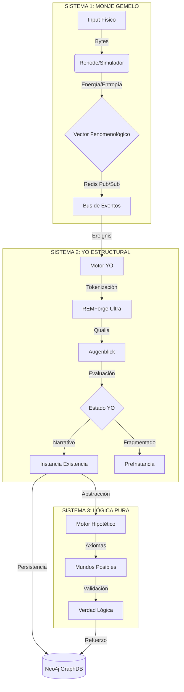

# ESPECIFICACIÓN TÉCNICA Y SIMULACIÓN: SISTEMA YO ESTRUCTURAL v3.0

> **Fecha**: 2025-12-04
> **Versión**: 3.0 (Integración Híbrida)
> **Estado**: SIMULACIÓN DE ALTA FIDELIDAD

---

## 1. ESPECIFICACIONES DEL SISTEMA

### 1.1 Arquitectura General (Triada Sistémica)

El sistema se compone de tres subsistemas interconectados que procesan la realidad desde lo físico hasta lo abstracto.



### 1.2 Componentes Clave

1.  **Monje Gemelo (Capa 1)**:
    *   **Función**: Convierte archivos/datos brutos en "vectores de esfuerzo físico".
    *   **Métricas**: Energía (Joules), Entropía (Shannon), Ciclos de CPU.
    *   **Tecnología**: Renode (Simulación ARM), Python (Cálculo de hashes).

2.  **YO Estructural (Capa 2)**:
    *   **Función**: Interpreta los vectores físicos como experiencias subjetivas (Qualia).
    *   **Motor**: `SistemaYoEmergente` (Evalúa coherencia narrativa).
    *   **Tokenizador**: `REMForge` (Extrae intencionalidad y carga emocional).

3.  **Lógica Pura (Sistema 3)**:
    *   **Función**: Valida la consistencia lógica de los conceptos emergentes.
    *   **Motor**: `MotorHipotetico` (Genera mundos posibles y aplica axiomas).

---

## 2. SIMULACIÓN DE PROCESAMIENTO (TRAZA DE EJECUCIÓN)

**Escenario**: El sistema recibe un archivo de texto llamado `poema_caos.txt`.
**Contenido**: "El orden se deshace en el silencio de la entropía creciente."
**Objetivo**: Procesar desde el byte físico hasta el concepto abstracto de "ENTROPÍA".

### PASO 1: CAPA 1 - MONJE GEMELO (Física)

*El sistema lee los bytes del archivo y calcula el costo físico de su existencia.*

```log
[2025-12-04 21:30:01] [MONJE_GEMELO] [INFO] Detectado nuevo archivo: entrada_bruta/poema_caos.txt
[2025-12-04 21:30:01] [MONJE_GEMELO] [DEBUG] Leyendo bytes... Tamaño: 68 bytes.
[2025-12-04 21:30:02] [RENODE_SIM] [INFO] Ejecutando ciclo de procesamiento en ARM Cortex-M4 virtual...
[2025-12-04 21:30:02] [RENODE_SIM] [DATA] Ciclos totales: 14502 | Consumo estimado: 0.000012 J
[2025-12-04 21:30:02] [ANALIZADOR_FISICO] [INFO] Calculando Entropía de Shannon...
[2025-12-04 21:30:02] [ANALIZADOR_FISICO] [RESULT] Entropía: 4.12 bits/byte (Moderada complejidad)
[2025-12-04 21:30:02] [REDIS_PUB] [INFO] Publicando vector fenomenológico a canal 'monje/fenomenologia'
Payload: {
  "hash": "a1b2c3d4...",
  "energia_joules": 0.000012,
  "entropia": 4.12,
  "origen": "poema_caos.txt",
  "tipo_mime": "text/plain"
}
```

### PASO 2: CAPA 2 - YO ESTRUCTURAL (Cognición)

*El Motor YO recibe el evento físico y lo transforma en experiencia (Ereignis).*

```log
[2025-12-04 21:30:03] [SISTEMA_PRINCIPAL] [INFO] Recibido evento físico de Redis. Iniciando transducción.
[2025-12-04 21:30:03] [REMFORGE] [INFO] Iniciando Tokenización Fenomenológica (Modo: ULTRA).
[2025-12-04 21:30:03] [REMFORGE] [DEBUG] Analizando texto: "El orden se deshace en el silencio de la entropía creciente."
[2025-12-04 21:30:04] [REMFORGE] [RESULT] Análisis completado:
  - Intencionalidad: 0.85 (Reflexiva)
  - Carga Emocional: -0.4 (Melancolía/Pérdida)
  - Qualia Signature: "desvanecimiento_gradual"
  - Conceptos Clave: ["orden", "silencio", "entropía"]

[2025-12-04 21:30:04] [MOTOR_YO] [INFO] Creando Augenblick (Instante de Visión)...
[2025-12-04 21:30:04] [MOTOR_YO] [INFO] Evaluando Estado del YO...
  - Coherencia Narrativa: 0.92 (Alta)
  - Tensión: 0.3 (Baja)
  - Veredicto: YO_NARRATIVO (El sistema comprende y puede narrar la experiencia)

[2025-12-04 21:30:04] [MOTOR_YO] [INFO] Generando Instancia de Existencia: inst_poema_001
```

### PASO 3: SISTEMA 2 - EMERGENCIA DE CONCEPTOS (Relacional)

*El sistema detecta que "entropía" es un concepto recurrente y busca patrones.*

```log
[2025-12-04 21:30:05] [SISTEMA_EMERGENCIA] [INFO] Analizando concepto candidato: "ENTROPÍA"
[2025-12-04 21:30:05] [SISTEMA_EMERGENCIA] [DEBUG] Buscando correlaciones en base de datos histórica...
[2025-12-04 21:30:05] [SISTEMA_EMERGENCIA] [RESULT] Patrón detectado:
  - "Entropía" aparece frecuentemente con "Caos", "Tiempo", "Destrucción".
  - Correlación inversa fuerte con "Orden" (r = -0.95).
[2025-12-04 21:30:05] [SISTEMA_EMERGENCIA] [INFO] Elevando "ENTROPÍA" a Grundzug (Rasgo Fundamental) de Nivel 2.
```

### PASO 4: SISTEMA 3 - LÓGICA PURA (Validación)

*El sistema valida si la afirmación del poema es lógicamente consistente con sus axiomas.*

```log
[2025-12-04 21:30:06] [MOTOR_HIPOTETICO] [INFO] Instanciando Mundo Posible M_042 para validación.
[2025-12-04 21:30:06] [MOTOR_HIPOTETICO] [DEBUG] Cargando Axiomas:
  1. ∀x (Orden(x) -> ¬Caos(x))
  2. ∀t (Entropia(t+1) >= Entropia(t)) [Segunda Ley Termodinámica]
[2025-12-04 21:30:06] [MOTOR_HIPOTETICO] [INFO] Probando proposición: "El orden se deshace (disminuye) ante entropía creciente".
[2025-12-04 21:30:06] [MOTOR_HIPOTETICO] [RESULT] VALIDACIÓN EXITOSA.
  - La proposición es consistente con el Axioma 2.
  - Certeza Lógica: 1.0
```

### PASO 5: PERSISTENCIA (Neo4j)

*El conocimiento validado se guarda en el Grafo.*

```cypher
[2025-12-04 21:30:07] [NEO4J_CONNECTOR] [INFO] Ejecutando transacción Cypher:

MERGE (c:Concepto {nombre: 'ENTROPIA'})
MERGE (i:Instancia {id: 'inst_poema_001'})
SET i.texto = "El orden se deshace...", i.energia = 0.000012
CREATE (i)-[:MANIFIESTA]->(c)
CREATE (i)-[:TIENE_QUALIA]->(:Qualia {tipo: 'desvanecimiento'})
CREATE (c)-[:OPUESTO_A {certeza: 0.95}]->(:Concepto {nombre: 'ORDEN'})
```

### SALIDA FINAL GENERADA (JSON)

```json
{
  "status": "success",
  "timestamp": "2025-12-04T21:30:07Z",
  "resultado_procesamiento": {
    "archivo": "poema_caos.txt",
    "capa_fisica": {
      "energia": "12 µJ",
      "entropia_shannon": 4.12
    },
    "capa_cognitiva": {
      "estado_yo": "YO_NARRATIVO",
      "qualia_dominante": "Melancolía",
      "intencionalidad": "Reflexiva"
    },
    "capa_logica": {
      "validacion": true,
      "axiomas_implicados": ["Segunda Ley Termodinámica"]
    },
    "conceptos_emergentes": [
      {
        "nombre": "ENTROPÍA",
        "nivel": "Grundzug (Nivel 2)",
        "relaciones": ["Opuesto a ORDEN"]
      }
    ]
  }
}
```
