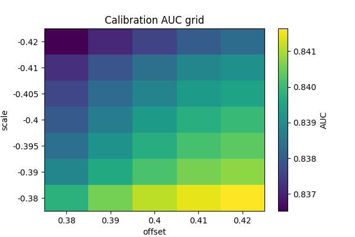

# Documentación detallada: Las 5 Capas del Omega 21

Este documento describe con detalle las cinco capas funcionales del sistema (Capa 1..Capa 5) y enlaza los artefactos producidos durante la campaña de calibración.

## Resumen funcional
- **Capa 1 — Sensorial**: 25 sub-redes ("átomos"), cada una procesa un subespacio del vector 256D y produce un embedding de salida (atom_mean, 25 × 64D). Artefactos: `calibracion/analysis/seed2_atoms_heatmap.png`, `seed*_atoms_heatmap.png`.
- **Capa 2 — Dual (Temporal + Espacial)**: Bi-LSTM para la dimensión temporal y Transformer-Encoder para la dimensión espacial. Artefactos: diagnósticos de `seed2_diag_*` y `seed*_logits.png`.
- **Capa 3 — Asociativa Inferior**: MLP residual que fusiona las representaciones temporales y espaciales (features fusionadas).
- **Capa 4 — Asociativa Superior**: Multi-head self-attention que produce representaciones de alto nivel (conceptos).
- **Capa 5 — Ejecutiva**: Capa de decisión/meta-cognición; genera la salida final y vectores para el hipergrafo.

## Artefactos relevantes (en este release)
- ONNX promovido: `calibracion/models/best_omega21.onnx` (promoted)
- Calibración (heatmaps & meta):
  - `calibracion/analysis/calibration_negscale_ultra_fine.json`
  - `calibracion/analysis/calibration_negscale_ultra_fine_meta.json`
  - `calibracion/analysis/calibration_negscale_ultra_fine_heatmap.png`
- Diagnósticos de átomos y head:
  - `calibracion/analysis/seed2_atoms_heatmap.png`
  - `calibracion/analysis/seed2_diag_atoms_heatmap.png`
  - `calibracion/analysis/seed2_diag_head_weights.png`

## Cómo reproducir las comprobaciones (rápido)
1. Ejecutar el script de verificación de capas:

```bash
python3 scripts/ci/check_5capas.py --checkpoint modelos_guardados/multi_seed_seed_2.pth --onnx calibracion/models/best_omega21.onnx
```

2. El script comprobará (resumen):
  - Presencia de componentes en el modelo PyTorch (emb, layers, head, losses relevantes).
  - Número de LSTM / layers disponibles.
  - Generación de 25 "átomos" mediante `diagnose_alucinacion.atoms_from_wave` y que su forma sea (25, ).

## Ejemplos de salida esperada (fragmentos)

- **Fragmento de metadatos de calibración** (`analysis/diagnosis/calibration_negscale_ultra_fine_meta.json`)

```json
{
  "best": { "scale": -0.38, "offset": 0.42, "auc": 0.841634 },
  "calibrated_auc": 0.841634,
  "validate_raw": { "passed": false, "stats": { "auc": 0.160775 } }
}
```

(Archivo de ejemplo: `calibracion/docs/examples/expected_calibration_meta.json`)

- **Fragmento de informe de diagnóstico (seed2)** (`analysis/diagnosis/seed2_diag_report.json`)

```json
{
  "seed_ck": "modelos_guardados/multi_seed_seed_2.pth",
  "n_stimuli": 8,
  "corr_atom_logits": 0.734,
  "plots": {
    "atoms_heatmap": "calibracion/analysis/seed2_atoms_heatmap.png",
    "logits": "calibracion/analysis/seed2_diag_logits.png"
  }
}
```

(Archivo de ejemplo: `calibracion/docs/examples/expected_seed2_diag_report.json`)

## Vistas rápidas (imágenes)
- Heatmap de átomos (ejemplo):


- Heatmap de calibración (grilla de AUC):



---

### Notas operacionales
- La arquitectura real está definida en `src/local_server/servidor_art_v7_hipergrafo.py` (ver sección "ARCHITECTURA DE RED JERÁRQUICA"). Este documento resume la traducción práctica de esa especificación para auditar calibraciones y releases.
- Si deseas que exporte un PDF con todos los gráficos y explicaciones, puedo generar un `calibracion/report_calibration.pdf` con las figuras principales.

