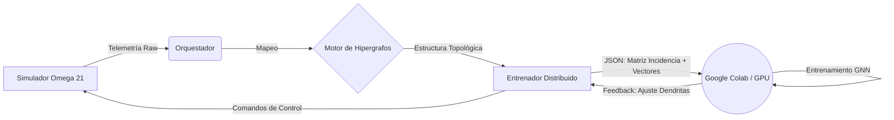

# PLAN MAESTRO DE ENTRENAMIENTO DISTRIBUIDO (OMEGA 21)

## 1. Arquitectura del Flujo de Datos



## 2. Especificación de Datos (Interface de Intercambio)

Para que el entrenamiento sea efectivo, el JSON enviado a Colab debe tener esta estructura exacta:

```json
{
  "batch_id": "uuid",
  "timestamp": "ISO8601",
  "samples": [
    {
      "node_features": [[0.1, 0.5], [0.9, 0.1], ...], // Características de cada nodo
      "edge_index": [[0, 1, 1, 2], [1, 0, 2, 1]],     // Conexiones (Grafo)
      "global_vector": [0.45, 0.12, ...],             // Vector Fenomenológico (256D)
      "target_stability": 0.85                        // Objetivo de entrenamiento
    }
  ]
}
```

## 3. Pasos de Implementación

### Paso 1: Serialización de Grafos (TypeScript)
- Modificar `EntrenadorDistribuido.ts`.
- Implementar método `serializarHipergrafo()` que convierta la clase `Hipergrafo` en tensores serializables.

### Paso 2: Servidor de Entrenamiento (Python/Colab)
- Implementar servidor FastAPI.
- Implementar modelo `OmegaGNN` usando PyTorch Geometric.
- Endpoint `/train` que acepte la estructura del Paso 1.

### Paso 3: Cierre del Bucle
- Recibir `dendrite_adjustments` desde Colab.
- Aplicar cambios en `DendriteController.ts`.
