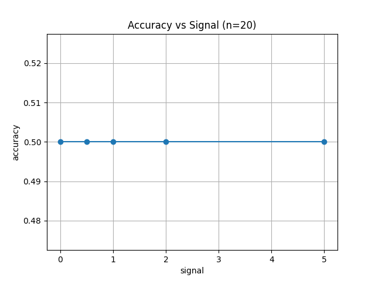
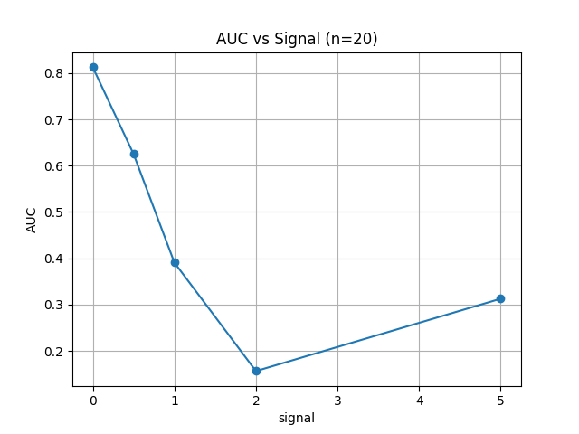
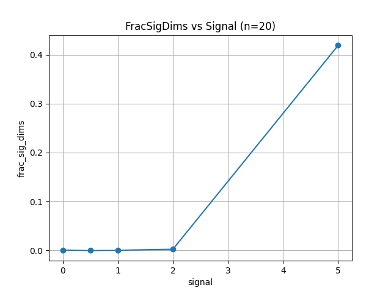
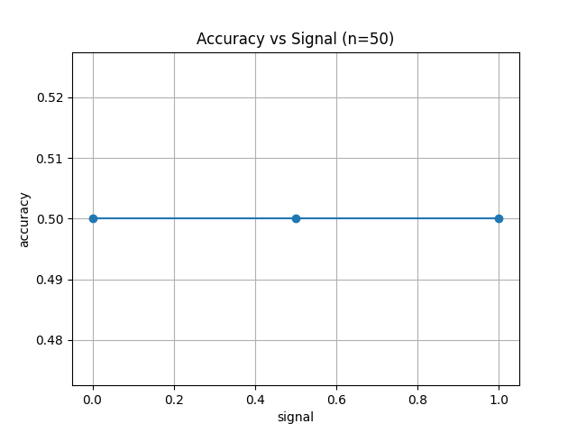
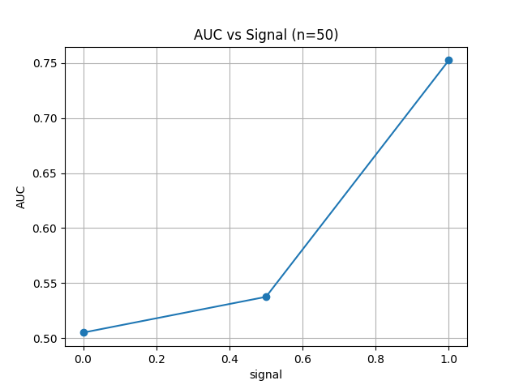
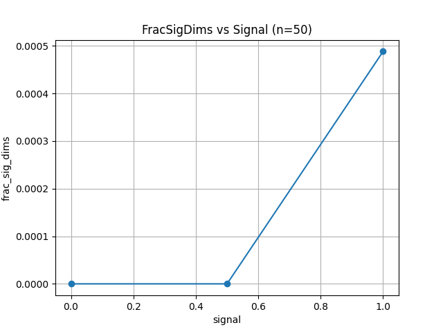

# Análisis 5‑capas — Resultados parciales

Estos resultados provienen de una ejecución del grid (señales y tamaños). Se guardó `analysis_5capas_detailed.json` con cada experimento.

## n = 20

## n = 50

